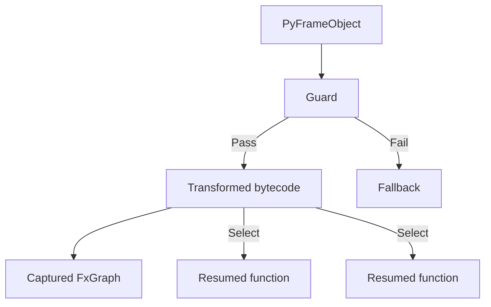
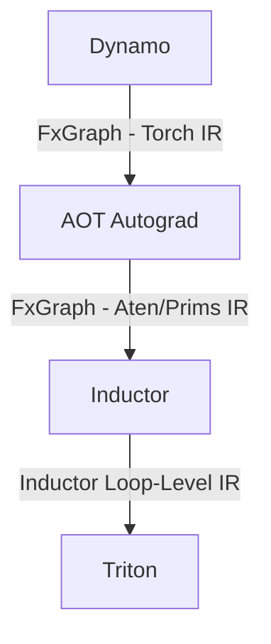

# Week 3: Pytorch Graph Mode

Pytorch + NPU 온라인 모임 #3 | 2024-12-18

<div class="abs-tl m-6">
  <span @click="$slidev.nav.go(1)" class="cursor-pointer opacity-50 hover:opacity-100 text-sm">
    ← 목차로 돌아가기
  </span>
</div>

---
level: 2
---

# Agenda Today

<div class="mt-4">

- <span class="text-orange-400 font-bold border border-orange-400 border-dashed px-2 py-1">Intro to graph mode in Pytorch 2.0 (5 min)</span>
- Graph capturing (30 min)
  - What is tracing?
  - Tracing in Pytorch 1.0 vs 2.0
  - How Dynamo works
- IR lowering (10 min)
- Integration with device backends (5 min)

</div>

<!--
PyTorch 2.0에서 가장 큰 변화는 그래프 모드의 도입이다. Lua Torch에서 시작된 PyTorch는 eager mode 철학으로 연구 커뮤니티에서 큰 호응을 얻었다. PyTorch 1.0에서 TorchScript(jit.trace, jit.script)가 추가되었고, 2.0에서는 더욱 향상된 그래프 모드가 도입되어 성능과 최적화가 강화되었다.
-->

---
level: 2
---

# Intro to Graph Mode in Pytorch 2.0

<div class="flex justify-center mt-4">
  
</div>

<div class="text-sm mt-4">

https://pytorch.org/get-started/pytorch-2.0/

</div>

<!--
PyTorch 2.0의 그래프 모드는 프론트엔드 → 백엔드 → 코드 생성 백엔드 구조를 따른다. 핵심 요소로 Dynamo(그래프 캡처), Autograd 통합, Inductor 및 Triton 백엔드가 있다. 기존 eager mode의 유연성을 유지하면서 컴파일러 최적화를 활용하여 성능을 개선하는 방향으로 설계되었다.
-->

---
level: 2
---

# 오늘 깊게 다루지 않을 부분

<div class="mt-8">

- **Legacy FX tracer**
- **AOTAutograd** → Week #4에서
- **Codegen backends** → "Pytorch + Nvidia GPU" 섹션에서

</div>

<!--
Legacy FX Tracer는 레거시 기능이므로 다루지 않음. Autograd는 다음 주에, Codegen Backend는 NVIDIA GPU 관련 시간에 다룰 예정.
-->

---
level: 2
---

# Agenda Today

<div class="mt-4">

- ~~Intro to graph mode in Pytorch 2.0 (5 min)~~
- <span class="text-orange-400 font-bold border border-orange-400 border-dashed px-2 py-1">Graph capturing (30 min)</span>
  - <span class="text-orange-400 font-bold border border-orange-400 border-dashed px-2 py-1">What is tracing?</span>
  - Tracing in Pytorch 1.0 vs 2.0
  - How Dynamo works
- IR lowering (10 min)
- Integration with device backends (5 min)

</div>

<!--
오늘의 핵심 주제는 Dynamo이며, IR lowering과 device backend 연동 방식도 간략히 다룰 예정이다.
-->

---
level: 2
---

# What is tracing?

<div class="grid grid-cols-2 gap-4 mt-4">
<div>
  
</div>
<div class="flex flex-col justify-center">

**Trace when d = 0**: L1-2 → d=? → L6 → J1 → L9

- **Control Flow Graph (CFG)**: 소스 코드를 그래프 형태로 표현
  - 노드: 분기점이 없는 연속적인 코드 블록
  - 에지: 프로그램의 실행 흐름 (분기, 점프)
- **Trace**: 프로그램 실행 시 CFG 상에서의 경로를 기록한 **linear list**
- 반복문이 있으면 동일 노드가 여러 번 나타남

</div>
</div>

<!--
트레이스는 프로그램이 실행될 때 컨트롤 플로우 그래프 상에서 어떤 경로를 따라 실행되었는지 기록한 것이다. 결과적으로 노드들이 순서대로 기록된 리니어 리스트 형태로 표현된다.
-->

---
level: 2
---

# Different Inputs → Different Traces

<div class="mt-4">

```
Program + Input A → Execute until termination → Trace for Input A
Program + Input B → Execute until termination → Trace for Input B
```

</div>

<div class="mt-8">

<v-clicks>

- 이론적으로 프로그램 전체의 Trace 생성 가능
- 하지만 **매우 비효율적** (1GHz CPU에서 1초에 10억 개의 Op 수행)
- **같은 프로그램이라도 입력이 다르면 Trace가 달라짐**
- 즉, Trace는 입력 의존적

</v-clicks>

</div>

<div class="text-center mt-4 text-gray-400 text-sm">

"이론적으론 가능, 하지만 매우 비효율적"

</div>

<!--
프로그램 전체를 Trace로 만들 수 있지만 실제로는 비효율적이다. 같은 프로그램이라도 입력이 다르면 Trace가 달라지며, 단순히 하나의 Trace만으로 모든 실행을 일반화할 수 없다.
-->

---
level: 2
---

# Trace 기반 최적화

**기본적인 idea**

<v-clicks>

- 반복 수행되는 구간을 파악, trace를 만들고
- 이 trace를 효율적으로 처리할 수 있는 최적화를 적용
- 이 trace에 진입한다고 판단되면 최적화해 놓은 대로 실행
- 만약 trace misprediction이 발생하면, 이에 대한 조치를 취하고 상황을 복구

</v-clicks>

<div class="mt-4">

**대표적인 사례**

- **Trace cache**: Transform hot traces into continuous cached blobs
- **Partial evaluation**: Remove a large chunk of computation by executing them ahead of time
- **ML compiler의 graph mode**: Trace helps identifying operators to be executed; Partial evaluation on trace effectively removes other Python code

</div>

<!--
Trace 기반 최적화의 핵심은 반복되는 코드 블록을 추출하여 최적화하는 것이다. Out-of-Order Execution, Trace Cache, Partial Evaluation 등이 대표적이며, PyTorch 2.0의 Dynamo도 이와 유사한 방식으로 동작한다.
-->

---
level: 2
---

# Trace를 이용한 최적화 예제: Trace Cache (Pentium 4에 적용)

<div class="mt-4">

**동작 방식:**

1. Instruction을 수행하며 반복될 가능성이 높은 trace를 저장
2. Trace의 시작점이 수행될 때 저장된 trace를 한꺼번에 fetch
3. Trace miss가 발생하면 trace에서 빠져나와 instruction cache에서 하나씩 fetch

</div>

<div class="mt-4">

**필요한 장치:**
- **Trace Cache**: 최적화된 Trace를 저장
- **Trace Predictor**: 어떤 Trace가 실행될지 예측
- **Trace Buffer**: 후보 Trace를 모아두는 버퍼

</div>

<!--
Trace Cache는 점프가 많은 코드에서 비연속적인 메모리 구간을 하나의 연속적인 블록으로 묶어 Fetch를 최적화한다. Pentium 4에서 최초로 적용되었다.
-->

---
level: 2
---

# Trace Cache 동작 방식

<div class="flex flex-col items-center gap-4 mt-2">
  
  
</div>

<!--
기존 Instruction Cache에서는 점프가 있으면 Fetch 효율이 저하된다. Trace Cache는 점프로 분리된 코드를 하나의 연속적인 Trace로 저장하여 한 번에 Fetch 가능하게 만든다.
-->

---
level: 2
---

# Partial Evaluation

<div class="grid grid-cols-2 gap-4 mt-4">
<div>
  
</div>
<div class="flex flex-col justify-center text-sm">

- **Partial-evaluate** program p given fixed input in1
- **Generate a specialized program** that performs only the remaining computation affected by dynamic input in2
- The specialized program is supposed to be **faster** than the original program p

<div class="text-xs text-gray-400 mt-4">

https://dl.acm.org/doi/10.1145/243439.243447

</div>

</div>
</div>

<!--
Partial Evaluation은 일부 입력(static input)을 고정하고 나머지(dynamic input)만 변할 수 있도록 하는 최적화 기법이다. 고정된 입력을 미리 계산하여 최적화된 프로그램을 생성한다. PyTorch 2.0의 Dynamo도 이와 유사한 방식으로 동작한다.
-->

---
level: 2
---

# Partial Evaluation: Example

<div class="mt-4 text-sm">

**원래 Trace:** `[A, A, B, C, D, D, E, E, E]` (static input + dynamic input)

- **Static input에만 영향받는 부분** (회색): 한 번 계산하면 안 바뀜
- Static input에 specialize하면:

**최적화된 Trace:** `[A, A, B, C, D, D, E, E, E]` (dynamic input만 필요)

</div>

<div class="mt-4">

- Static input은 더 이상 필요 없음 (영향이 이미 반영됨)
- Static input에만 영향을 받는 code는 다시 계산할 필요가 없음
- **Static input이 바뀌면 최적화된 Trace도 달라져야 함**

</div>

<!--
Static Input에만 영향을 받는 연산을 미리 계산하고, Dynamic Input에 영향을 받는 부분만 실행한다. Static Input이 바뀌면 새로운 Partial Evaluation이 필요하다.
-->

---
level: 2
---

# Tracing ML Models Written in Python

<div class="grid grid-cols-2 gap-4 mt-4">
<div>

- Python으로 작성된 모델에서 **device에서 수행할 부분과 그렇지 않은 부분을 분리**할 수 있는 매우 효과적인 방법
  - 정적 분석 등을 생각해 볼 수 있으나 너무 복잡하고 실용적이지 않음
- 수행 과정에 필요한 **tensor의 shape**들도 tracing 과정에서 판별 가능
  - Memory allocation과 operator 최적화에 결정적인 도움
- **Graph 최적화** 적용도 가능
  - Op Fusion
  - Constant propagation
  - Common subexpression elimination

</div>
<div class="flex flex-col justify-center">

<div class="text-xl font-bold text-center p-4 border border-orange-400 rounded">

Tracing은 Graph Mode의 근간이 되는 기술이라 볼 수 있음

</div>

</div>
</div>

<!--
Python으로 작성된 복잡한 일반 코드는 GPU/NPU에서 직접 가속이 거의 불가능하다. Tracing을 통해 디바이스에서 실행 가능한 부분을 분리하고, tensor shape 판별, graph 최적화 등을 수행할 수 있다.
-->

---
level: 2
---

# Python Basics

<div class="flex justify-center mt-4">
  
</div>

<div class="mt-4">

1. Initializes CPython
2. Compiles a source code to a **code object** (compiler)
3. Executes the **bytecode** within the code object (virtual machine)

</div>

<!--
Python 코드가 실행되면 CPython이 소스 코드를 바이트 코드로 변환하고, Virtual Machine의 Evaluation Loop에서 실행한다. Interpreter에서 실행되는 바이트 코드를 수집하면 Trace를 얻을 수 있다.
-->

---
level: 2
---

# Python VM

<div class="text-sm">

- **Runtime** - VM's global state
- **Interpreter** - a group of threads + shared data (ex: imported modules)
- **Thread** - corresponds to an OS thread; includes a call stack
- **Frame** - an element of the call stack; has a code object & its execution state
- **Evaluation loop** - a place where bytecode gets actually executed

</div>

<div class="flex justify-center mt-4">
  
</div>

<div class="text-center text-sm text-gray-400 mt-2">

Call stack as a linked list of frame objects

</div>

<!--
Evaluation Loop이 bytecode를 하나씩 수행하고, Frame은 함수 실행 환경을 제공한다. Call stack은 여러 frame이 쌓여 함수 호출을 관리하며, 여러 thread가 모여 Python Interpreter를 구성한다.
-->

---
level: 2
---

# 이론적으로는 CPython을 활용, bytecode 수준에서 end-to-end trace를 만들어 낼 수 있음

<div class="flex justify-center mt-4">
  
</div>

<div class="text-center mt-4">

실행되는 bytecode를 모두 기록 → end-to-end trace를 생성

</div>

---
level: 2
---

# PyTorch의 Tracing 방식 발전

<div class="mt-4">

**1.0**

| 방식 | 설명 |
|------|------|
| `jit.trace` | Dispatcher를 활용, trace mode를 추가 |
| `jit.script` | Python의 subset을 처리할 수 있는 tracing 전용 interpreter를 개발 |

**2.0**

| 방식 | 설명 |
|------|------|
| **Dynamo** | jit.trace / jit.script의 단점을 해결하기 위해 CPython에 직접 tracing 기능을 integrate |

</div>

<div class="text-sm text-gray-400 mt-4">

다른 시도들도 있었으나, Dynamo가 가장 효과적인 해결책으로 자리잡음

</div>

<!--
jit.trace는 Dispatcher를 활용한 간단한 tracing이지만 입력에 의존적이다. jit.script는 Python subset만 처리 가능하여 한계가 있었다. PyTorch 2.0의 Dynamo는 CPython에 직접 통합하여 이 단점들을 해결했다.
-->

---
level: 2
---

# jit.trace의 단점

<div class="p-4 border border-red-400 rounded mt-4">

Operator의 결과가 if statement의 조건에 영향을 줄 경우, jit.trace로 생성된 trace는 **안전하지 않을 수 있음**

- 특정 input에서는 잘못된 결과 생성 가능

</div>

<div class="flex justify-center mt-4">
  
</div>

<!--
Dynamic input에 의해 영향을 받는 branch가 있으면 jit.trace는 잘못 동작할 수 있다. 특정 입력에서만 트레이스를 해놓으면 다른 입력에서는 예상과 다른 결과가 발생할 수 있다.
-->

---
level: 2
---

# How Dynamo Works

<div class="mt-8">

- Concept
- CPython Architecture
- Python VM
- Dynamo Integrated with CPython
- Trace Generation: Overall Flow
- Trace Generation의 결과물
- Trace Replay

</div>

---
level: 2
---

# Dynamo: Concept

<div class="mt-2 text-sm">

**Trace 생성 과정:**

```
[■][■][■][■][■][■][■][■][■][■][■][■][■][■][■][■][■][■][■][■][■][■][■][■]
      Break           Break                 Break
 Trace #1      Trace #2         Trace #3          Trace #4
```

**Trace 실행 과정:**

```
[Check → Trace #1] → [Check → Trace #2] → [Check → Trace #3] → [Check → Trace #4]
```

</div>

<div class="mt-4">

<v-clicks>

- Trace 불가능한 구간(Breakpoint)을 식별하여 Trace를 **여러 개로 분할**
- 각 Trace 진입 전 **Guard로 조건 검사** 후 최적화된 코드 실행
- Break 구간은 원래 방식으로 실행 후 다음 Trace로 이동
- 이 과정은 **recursive**하게 동작

</v-clicks>

</div>

<!--
Dynamo는 Trace 가능한 부분을 찾고, Breakpoint에서 멈춘 후 최적화된 Trace를 생성한다. Breakpoint 이후에는 재귀적으로 Trace를 이어가며 최적화된 실행을 반복한다.
-->

---
level: 2
---

# Dynamo Integrated with CPython

<div class="grid grid-cols-2 gap-4 mt-4">
<div class="text-sm">

**Frame object를 확장하여 tracing 기능을 구현:**

- Bytecode analysis
- Bytecode transformation
- FxGraph construction
- User-defined compilation
- Guard insertion

</div>
<div>
  
</div>
</div>

<!--
Dynamo는 CPython의 frame object를 활용하여 동작한다. 함수가 처음 tracing되면 bytecode를 분석하고, breakpoint까지 추적하여 최적화 코드를 생성한다. 이후 재호출 시 Guard를 통해 캐시된 결과를 재사용할 수 있는지 확인한다.
-->

---
level: 2
---

# [참고] Dynamo Internal Flow

<div class="flex justify-center">
  
</div>

<!--
Dynamo 내부가 동작하는 과정을 자세히 그려놓은 그림이다. 기회가 되시는 분들은 조금 더 자세히 보시면 좋다.
-->

---
level: 2
---

# Trace Generation: Overall Flow

<div class="mt-4">

1. 실행해야 할 **bytecode**와 처리할 **input**이 주어짐
2. Bytecode와 input을 가지고 **graph break를 만날 때까지** trace를 생성
3. 만들어진 trace를 가지고 **bytecode transformation**을 수행
   - Transformation의 결과물:
     - **Guard** (static input 검증 로직)
     - **Transformed bytecode**
     - **Captured computation graph** (FX Graph)
     - **Resumed functions**
4. Trace 생성을 **다시 시작**
   - 자연스럽게 resume function 중 하나가 선택됨
   - 선택된 resumed function의 bytecode를 가지고 위의 과정을 다시 반복

</div>

<!--
Trace Generation은 bytecode와 input이 주어지면 graph break까지 trace를 생성하고, bytecode transformation을 수행하여 Guard, FX Graph, Resumed Functions을 만든다. 이후 resumed function을 통해 반복적으로 tracing을 수행한다.
-->

---
level: 2
---

# Trace Generation의 결과물

<div class="flex justify-center mt-4">



</div>

<!--
Function의 frame 안에서 guard가 조건을 만족하면 cache된 결과물을 사용한다. 가장 중요한 부분은 캡처된 FX Graph에 대한 계산 수행이며, 이후 resume function으로 다음 과정을 반복한다.
-->

---
level: 2
---

# Trace Replay: Overall Flow

<div class="mt-4">

**Guard의 조건을 만족하면:**

- Cache되어 있는 transformed bytecode를 재활용할 수 있음
- 먼저 captured computation graph에 해당하는 compiled function을 수행
- 이후 trace되지 못한 graph break 부분을 수행
- 자연스럽게 resumed function이 결정되고 이를 수행

**Guard의 조건이 만족되지 못하면:**

- Cache되어 있는 transformed bytecode를 재활용할 수 없음
- **Retracing이 trigger**되어 새로운 trace를 생성

</div>

---
level: 2
---

# Agenda Today

<div class="mt-4">

- ~~Intro to graph mode in Pytorch 2.0 (5 min)~~
- ~~Graph capturing (30 min)~~
  - ~~What is tracing?~~
  - ~~Tracing in Pytorch 1.0 vs 2.0~~
  - ~~How Dynamo works~~
- <span class="text-orange-400 font-bold border border-orange-400 border-dashed px-2 py-1">IR lowering (10 min)</span>
- Integration with device backends (5 min)

</div>

---
level: 2
---

# IR Lowering

<div class="flex justify-center mt-4">



</div>

<div class="mt-4 text-sm">

- **Dynamo** → FxGraph (Torch IR): 상위 레벨의 추상화, lowering이 많이 이루어지지 않은 상태
- **AOT Autograd** → FxGraph (Aten/Prims IR): gradient 계산 처리 후 보다 구체화된 IR
- **Inductor** → Loop-Level IR: Fusion 등 최적화 수행 후 백엔드에 전달
- **Triton**: 백엔드 특화된 표현으로 변환하여 실행

</div>

<!--
PyTorch 2.0에서는 IR들이 체계적으로 lower되는 과정이 설계되어 있다. Dynamo가 Torch IR을 뱉어내고, AOT Autograd를 거쳐 Aten/Prims IR로 변환, Inductor에서 Loop-Level IR로 만들어 백엔드에 전달한다.
-->

---
level: 2
---

# Torch IR, Aten, Core Aten, and Prims IR

<div class="grid grid-cols-2 gap-4 mt-4">
<div class="text-sm">

- **Torch IR**
  - PyTorch이 지원하는 2,000개가 넘는 연산자에 해당
- **Aten**
  - 750여개의 canonical ops
  - 기존에 이미 Pytorch를 지원하고 있는 backend가 사용 (Intel CPU, NVIDIA GPU 등)
- **Core Aten**
  - Aten 내에서도 low-level인 약 250여개의 operations
  - 반드시 저수준의 Ops를 의미하는 것은 아님
    - e.g. avgpool2d, convolution 등의 high-level ops도 포함
- **Prims IR**
  - 250여개의 primitives (현재 129개)
  - Explicit type promotion과 broadcasting이 필요

</div>
<div>


<div class="text-xs text-gray-400 mt-4">

Torch IR → Prim IR 변환

https://pytorch.org/docs/main/torch.compiler_ir.html

</div>

</div>
</div>

<!--
Torch IR은 Python 코드 수준의 모든 연산자, Aten은 750개의 canonical ops, Core Aten은 250여개의 low-level ops, Prims IR은 타입 정보와 Broadcasting을 명시적으로 표현한 형태이다. Prims 단계까지는 Device-Independent하다.
-->

---
level: 2
---

# Agenda Today

<div class="mt-4">

- ~~Intro to graph mode in Pytorch 2.0 (5 min)~~
- ~~Graph capturing (30 min)~~
  - ~~What is tracing?~~
  - ~~Tracing in Pytorch 1.0 vs 2.0~~
  - ~~How Dynamo works~~
- ~~IR lowering (10 min)~~
- <span class="text-orange-400 font-bold border border-orange-400 border-dashed px-2 py-1">Integration with device backends (5 min)</span>

</div>

---
level: 2
---

# Integration with Device Backend

<div class="grid grid-cols-2 gap-4 mt-4">
<div>
  
</div>
<div>
  
</div>
</div>

<div class="mt-4 text-sm">

- `torch.compile(model)`을 호출하면 컴파일 의도가 반영된 모델이 반환됨
- 실제 컴파일은 **모델 실행 시** 수행 (Dynamo가 동작하여 Trace 생성)
- Custom backend는 **Backend Object를 생성**하고 Function을 구현하여 등록
- 두 번째 실행부터는 캐시된 결과를 활용하여 **컴파일 오버헤드 없이** 실행

</div>

<!--
사용자는 torch.compile(model)을 호출하여 컴파일된 모델을 얻는다. Custom backend를 추가하려면 backend object를 만들어 등록하면 된다. 첫 실행 시 tracing과 compilation이 수행되고, 이후에는 cache를 활용하여 빠르게 실행된다. IR은 Prims 단계까지 Device-Independent하며, 이후 특정 디바이스에 맞춰 변환된다.
-->
