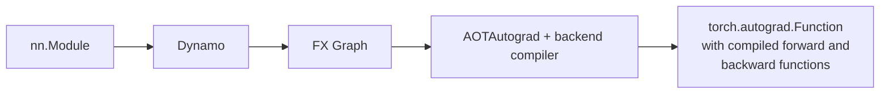

# Week 4: Automatic Differentiation in Pytorch

Pytorch + NPU 온라인 모임 #4 | 2025-01-08

<div class="abs-tl m-6">
  <span @click="$slidev.nav.go(1)" class="cursor-pointer opacity-50 hover:opacity-100 text-sm">
    ← 목차로 돌아가기
  </span>
</div>

<!--
오늘은 automatic differentiation에 대해 다룹니다. 지금까지 전반적인 기술 개요, eager 모드, graph 모드를 다뤘고, 이번에는 가장 중요한 부분인 automatic differentiation을 깊이 살펴봅니다.
-->

---
level: 2
---

# Agenda

<div class="mt-4">

- <span class="text-orange-400 font-bold border border-orange-400 border-dashed px-2 py-1">Background</span>
  - <span class="text-orange-400 font-bold border border-orange-400 border-dashed px-2 py-1">Supervised Learning</span>
  - <span class="text-orange-400 font-bold border border-orange-400 border-dashed px-2 py-1">Backprop</span>
  - <span class="text-orange-400 font-bold border border-orange-400 border-dashed px-2 py-1">Automatic Differentiation</span>
- Automatic Differentiation in Pytorch
  - Pytorch 1.0: Autograd
  - Pytorch 2.0: AOTAutograd

</div>

<!--
전체 아젠다는 먼저 automatic differentiation의 기술적 백그라운드를 커버하고, 이것이 PyTorch에서 어떻게 구현되어 있는지 두 부분으로 나눠서 다룹니다.
-->

---
level: 2
---

# Supervised Learning

<div class="grid grid-cols-2 gap-4 mt-4">
<div>

**$f(x) = ax + b$**

| | input | output |
|---|---|---|
| | $x_0$ | $y_0$ |
| | $x_1$ | $y_1$ |
| | $x_2$ | $y_2$ |

<div class="mt-2 text-sm">

- **model**: $f(x) = ax + b$
- **training data**: $(x_i, y_i)$ 쌍
- **weights**: $a$, $b$

</div>

</div>
<div class="flex flex-col justify-center">

**a와 b를 조정하여 최적의 함수를 찾아가는 과정**

<v-clicks>

- Training data가 주어졌을 때 loss를 최소화하는 weight 값으로 조금씩 변해가는 과정
- 기울기($a$)를 조금 조정하고, bias($b$)를 조금 이동
- 점들을 가장 잘 표현하는 선을 찾아가는 것이 training

</v-clicks>

</div>
</div>

<!--
Supervised Learning은 training data가 주어졌을 때, weight(a, b)를 조정하여 데이터를 가장 잘 표현하는 함수를 찾아가는 과정입니다. 기울기와 bias를 조금씩 조정하면서 loss를 최소화하는 값으로 수렴합니다.
-->

---
level: 2
---

# Supervised Learning: Forward & Backward


<div class="text-sm mt-2">

- **Forward**: 입력 데이터를 네트워크에 통과시켜 출력값 계산
- **Loss Function**: 기대 출력과 예측 출력의 차이를 계산
- **Backward**: 손실을 최소화하기 위해 가중치가 어떻게 변해야 하는지 gradient 계산
- **Optimizer**: 계산된 gradient를 기반으로 가중치를 조정
- 이 과정을 반복하여 손실을 줄이며 학습 진행 → **autodiff**

</div>

<!--
Forward에서 output을 계산하고, loss function으로 기대값과의 차이를 구합니다. Backward(backpropagation)에서 loss를 줄이기 위한 gradient를 계산하고, optimizer가 가중치를 업데이트합니다. 이 backward 과정이 자동화된 것이 automatic differentiation입니다.
-->

---
level: 2
---

# (Reverse-Mode) Automatic Differentiation

An algorithm that implements back propagation that consists of

<v-clicks>

- Construction of **computation graph**
- Derivation of a **gradient function** at each node of computation graph
- **Backward walking** of the graph to propagate gradients

</v-clicks>

<div class="mt-4">

</div>

<div class="text-sm mt-2">

Chain Rule: $\frac{dy}{dx} = \frac{dy}{dt} \cdot \frac{dt}{dx}$ where $t = g(x)$, $y = f(t)$

</div>

<!--
체인 룰(Chain Rule)은 복합 함수의 미분을 안쪽 함수부터 순차적으로 수행하는 방법입니다. 신경망에서 출력에서 입력으로 기울기를 역으로 전파하여 가중치를 업데이트하는 과정이 backpropagation의 핵심 원리입니다.
-->

---
level: 2
---

# Example

$$f(x_1, x_2) = \ln(x_1) + x_1 x_2 - \sin(x_2)$$

<div class="grid grid-cols-2 gap-2 mt-2">
  
  
</div>


<div class="text-sm mt-2">

https://www.jmlr.org/papers/volume18/17-468/17-468.pdf

</div>

<!--
Forward Graph가 존재하면, 이를 기반으로 역으로 편미분을 수행할 수 있습니다. 각 노드에서 편미분을 계산하여 이전 노드로 전파하며 기울기를 구하는 과정을 Reverse Trace라고 합니다. Forward Primal Trace로 중간값을 저장하고, Reverse Adjoint Trace로 역방향으로 gradient를 계산합니다.
-->

---
level: 2
---

# Example: Forward & Backward 계산

<div class="grid grid-cols-2 gap-4 mt-4">
  
  
</div>

<div class="text-sm mt-4">

**Forward**: $a=2, b=1$ → $c=a+b=3$, $d=b+1=2$, $e=c \cdot d = 6$

**Backward**: $\frac{de}{da} = \frac{de}{dc} \cdot \frac{dc}{da} = 2 \cdot 1 = 2$, $\frac{de}{db} = \frac{de}{dc} \cdot \frac{dc}{db} + \frac{de}{dd} \cdot \frac{dd}{db} = 2 \cdot 1 + 3 \cdot 1 = 5$

</div>

<!--
왼쪽은 forward 과정, 오른쪽은 backward 과정입니다. Forward에서 e=6을 계산하고, backward에서 체인 룰을 적용하여 de/da=2, de/db=5를 구합니다. 이처럼 mechanical하게 정해진 알고리즘을 따라 순서대로 계산하면 gradient를 체계적으로 구할 수 있습니다.
-->

---
level: 2
---

# Agenda

<div class="mt-4">

- ~~Background~~
  - ~~Supervised Learning~~
  - ~~Backprop~~
  - ~~Automatic Differentiation~~
- <span class="text-orange-400 font-bold border border-orange-400 border-dashed px-2 py-1">Automatic Differentiation in Pytorch</span>
  - <span class="text-orange-400 font-bold border border-orange-400 border-dashed px-2 py-1">Pytorch 1.0: Autograd</span>
  - Pytorch 2.0: AOTAutograd

</div>

---
level: 2
---

# Pytorch 1.0: Autograd

**Eager mode를 위한 Pytorch의 autodiff**

<v-clicks>

- 매 operator가 수행될 때마다 computation graph를 **incremental**하게 build up
  - Dispatcher를 활용, operator overloading (Autograd dispatch key)
- Tensor별로 gradient가 필요한지 선택 가능
  - 불필요한 gradient 계산을 피하기 위해
  - Backprop을 하기 전, transitive하게 gradient가 필요한 tensor를 선별
- **Custom differentiable function** 제공

</v-clicks>

<!--
PyTorch의 Autograd는 Eager Mode에서 각 연산 수행 시 computation graph를 점진적으로 구축합니다. Dispatcher와 operator overloading을 활용하며, tensor별로 require_grad 플래그로 gradient 필요 여부를 선택할 수 있습니다. 또한 custom differentiable function을 정의할 수 있는 유연성을 제공합니다.
-->

---
level: 2
---

# Example

<div class="grid grid-cols-2 gap-4 mt-4">
<div>

```python
x = torch.tensor(2.0)
x.requires_grad = True
y = x * 2
z = y ** 2
z.backward()
print(x)
print(y)
print(z)
print(x.grad)
```

</div>
<div class="flex flex-col justify-center text-sm">

```
tensor(2., requires_grad=True)
tensor(4., grad_fn=<MulBackward0>)
tensor(16., grad_fn=<PowBackward0>)
tensor(16.)
```

- $x = 2$, $y = 2x = 4$, $z = y^2 = 16$
- $\frac{dz}{dx} = \frac{dz}{dy} \cdot \frac{dy}{dx} = 2y \cdot 2 = 8 \cdot 2 = 16$

</div>
</div>

<!--
x=2에서 시작하여 y=2x=4, z=y^2=16을 계산합니다. backward를 호출하면 chain rule을 적용하여 dz/dx = 2y * 2 = 8 * 2 = 16이 됩니다.
-->

---
level: 2
---

# Example: Step 1

<div class="grid grid-cols-2 gap-4 mt-4">
<div>

```python {1-2}
x = torch.tensor(2.0)
x.requires_grad = True
y = x * 2
z = y ** 2
z.backward()
```

</div>
<div class="flex flex-col justify-center">

**Computation Graph 상태:**

```
x:2 →
```

- $x = 2$로 초기화
- `requires_grad = True`로 gradient 필요 마킹

</div>
</div>

<!--
x=2 값이 들어오고, requires_grad=True로 gradient가 필요하다고 마킹된 상태입니다.
-->

---
level: 2
---

# Example: Step 2

<div class="grid grid-cols-2 gap-4 mt-4">
<div>

```python {3}
x = torch.tensor(2.0)
x.requires_grad = True
y = x * 2
z = y ** 2
z.backward()
```

</div>
<div class="flex flex-col justify-center">

**Computation Graph 상태:**

```
y:4 → [MulBackward0: 2]
           ↑
x:2 ───────┘
```

- $y = x \times 2 = 4$
- `MulBackward0` grad function이 등록됨
- x가 `requires_grad=True`이므로 y도 자동으로 gradient 추적

</div>
</div>

<!--
y=x*2를 계산하면서 MulBackward0라는 grad function이 등록됩니다. x의 requires_grad가 True이므로, y에 연결되는 backward 함수가 자동으로 기록됩니다.
-->

---
level: 2
---

# [참고] Forward에서 수행되는 AutoGrad kernel 예제: add


<div class="text-sm mt-2">

- `compute_requires_grad`: gradient가 필요한 계산인지 판별
- 필요하면 `grad_fn` (예: `AddBackward0`)을 등록
- `next_edges`로 backward graph를 생성
- Forward 수행 중에 backward에 필요한 정보를 미리 기록

</div>

<!--
Autograd kernel은 자동 생성된 코드입니다. Forward 수행 중 compute_requires_grad로 gradient 필요 여부를 판별하고, 필요하면 grad_fn을 등록하여 backward graph를 미리 기록합니다. Dispatch key가 autograd kernel을 사용하도록 설정되어 있기 때문에 가능합니다.
-->

---
level: 2
---

# [참고] Grad Functions

<div class="flex justify-center items-center h-64">
<div class="border-2 border-dashed border-gray-400 p-8 rounded-lg text-center text-gray-400">

Codegen된 example (TODO)

`derivatives.yaml`에 정의된 Op들의 미분 규칙으로부터 자동 생성

</div>
</div>

<!--
이 슬라이드는 Codegen된 AddBackward0 등의 코드 예제를 넣을 예정이었으나 아직 작성되지 않았습니다. derivatives.yaml 파일에 PyTorch 기본 Op들의 미분 규칙이 정의되어 있고, 이를 기반으로 자동 생성됩니다.
-->

---
level: 2
---

# Example: Step 3

<div class="grid grid-cols-2 gap-4 mt-4">
<div>

```python {4}
x = torch.tensor(2.0)
x.requires_grad = True
y = x * 2
z = y ** 2
z.backward()
```

</div>
<div class="flex flex-col justify-center">

**Computation Graph 상태:**

```
z:16 → [PowBackward: 2y]
            ↑
y:4  → [MulBackward0: 2]
            ↑
x:2  ───────┘
```

- $z = y^2 = 16$
- `PowBackward` grad function 등록
- Forward 완료, backward graph 준비 완료

</div>
</div>

<!--
z=y^2를 계산하면서 PowBackward grad function이 등록됩니다. 이 시점에서 forward 계산이 완료되고, backward graph가 준비된 상태입니다.
-->

---
level: 2
---

# Example: Step 4.1 - Backward 시작

<div class="grid grid-cols-2 gap-4 mt-4">
<div>

```python {5}
x = torch.tensor(2.0)
x.requires_grad = True
y = x * 2
z = y ** 2
z.backward()
```

</div>
<div class="flex flex-col justify-center">

**Backward 과정:**

$$\frac{dz}{dz} = 1$$

$$\text{PowBackward: } \frac{dz}{dy} = 2y$$

- 출력 자신에 대한 gradient는 항상 **1**
- $1$이 PowBackward로 전달됨

</div>
</div>

<!--
Backward는 출력에 대한 gradient 1부터 시작합니다. PowBackward 함수는 y^2의 미분식인 2y를 반환하며, y=4이므로 2*4=8이 됩니다.
-->

---
level: 2
---

# Example: Step 4.2 - Gradient 전파

<div class="grid grid-cols-2 gap-4 mt-4">
<div>

**PowBackward 단계:**

$$1 \times 2y = 1 \times 2 \times 4 = 8$$

</div>
<div>

**MulBackward0 단계:**

$$8 \times 2 = 16$$

</div>
</div>

<div class="mt-4 text-center">

$$\frac{dz}{dx} = \frac{dz}{dy} \cdot \frac{dy}{dx} = 8 \times 2 = 16$$

</div>

<div class="text-sm mt-4">

- 위에서 온 민감도(gradient)가 계속 누적되면서 곱해지는 과정
- 최종적으로 `x.grad = 16`이 저장됨
- 더 복잡한 모델에서도 근본적으로 이 과정이 반복적으로 일어남

</div>

<!--
PowBackward에서 1*2y = 8이 나오고, MulBackward0에서 8*2 = 16이 됩니다. 위에서 내려온 gradient가 누적되면서 곱해지는 chain rule 과정이며, 최종적으로 x.grad = 16이 됩니다.
-->

---
level: 2
---

# Example: Step 4.3 - 최종 결과

<div class="grid grid-cols-2 gap-4 mt-4">
<div>

```
        1
        ↓
[PowBackward: 2y]  →  1 × 2×4 = 8
        ↓
[MulBackward0: 2]  →  8 × 2 = 16
        ↓
     x.grad = 16
```

</div>
<div class="flex flex-col justify-center">

```python
print(x.grad)
# tensor(16.)
```

<div class="mt-4">

**검증:**

$z = (2x)^2 = 4x^2$

$\frac{dz}{dx} = 8x = 8 \times 2 = 16$ ✓

</div>

</div>
</div>

<!--
최종적으로 x.grad = 16이 됩니다. z = (2x)^2 = 4x^2이므로 dz/dx = 8x = 16으로 검증할 수 있습니다. 더 복잡한 모델에서도 이 과정이 반복적으로 일어납니다.
-->

---
level: 2
---

# [참고] backward(): Python → C++

<div class="mt-4">

```
backward()
  └→ run_backward()
       └→ Engine::execute()
            └→ graph_task->init_to_execute()
                 execute_with_graph_task()
                   └→ Engine::evaluate_function()
                        └→ call_function()  ← 실제 grad function이 불리는 곳
```

</div>

<div class="text-sm mt-4">

- Python에서 `backward()` 호출 → C++ Autograd Engine으로 전달
- `Engine::execute()`가 graph_task를 생성하고 실행 준비
- `evaluate_function()`에서 실제 backward 계산 수행
- Python 레벨에서는 wrapper만 존재, 실제 연산은 C++에서 수행

</div>

<!--
backward() 함수는 C++ Autograd Engine을 통해 동작합니다. Engine::execute()가 graph_task를 생성하고, evaluate_function()에서 실제 backward 계산을 수행합니다. Python에서는 wrapper만 존재하며 실제 구현은 C++입니다.
-->

---
level: 2
---

# Agenda

<div class="mt-4">

- ~~Background~~
  - ~~Supervised Learning~~
  - ~~Backprop~~
  - ~~Automatic Differentiation~~
- <span class="text-orange-400 font-bold border border-orange-400 border-dashed px-2 py-1">Automatic Differentiation in Pytorch</span>
  - ~~Pytorch 1.0: Autograd~~
  - <span class="text-orange-400 font-bold border border-orange-400 border-dashed px-2 py-1">Pytorch 2.0: AOTAutograd</span>

</div>

<!--
Eager mode의 Autograd를 살펴봤고, 이제 Graph mode에서의 automatic differentiation인 AOTAutograd를 다룹니다. Graph mode에서는 FX Graph를 하나의 큰 Op으로 보고 해당 Op의 미분을 계산하는 AOT(Ahead-of-Time) Autograd 접근법을 사용합니다.
-->

---
level: 2
---

# What Happens When Training with torch.compile()?

<div class="grid grid-cols-2 gap-4 mt-4">
<div>

**Eager Mode**

```python
outputs = model(images)
loss = F.cross_entropy(outputs, labels)
loss.backward()
```

<div class="text-xs text-gray-400 mt-2">

Typical training process in Pytorch eager mode

</div>

</div>
<div>

**Graph Mode**

```python
compiled_model = torch.compile(model)
outputs = compiled_model(images)
loss = F.cross_entropy(outputs, labels)
loss.backward()
```

<div class="text-xs text-gray-400 mt-2">

What happens if we apply `torch.compile()` to the model?

</div>

</div>
</div>

<!--
Eager mode에서는 모델을 직접 실행하지만, Graph mode에서는 torch.compile()으로 모델을 컴파일합니다. 겉으로는 큰 차이가 없어 보이지만, 내부적으로는 Dynamo가 tracing하여 FX Graph를 생성하고 최적화된 방식으로 forward/backward가 수행됩니다.
-->

---
level: 2
---

# Training + torch.compile()


<div class="text-sm mt-2">

1. Dynamo의 FX Graph가 **AOTAutograd**에 의해 compiled forward/backward를 포함하는 `torch.autograd.Function`으로 변환. Forward 실행 후 output의 backward는 compiled backward
2. Loss 계산은 Autograd가 적용된 **eager mode**로 실행 → loss function의 grad function 산출
3. Loss function의 grad function → compiled backward를 순차적으로 처리, model weight의 gradient 계산

</div>

<div class="text-xs text-gray-400 mt-2">

AOTAutograd에 의해 생성된 compiled forward/backward functions (wrapped as `torch.autograd.Function`)

</div>

<!--
torch.compile 실행 시 3단계로 동작합니다. 1) FX Graph가 AOTAutograd에 의해 compiled forward/backward를 포함하는 torch.autograd.Function으로 변환되고, 2) loss 계산은 eager mode로 수행되며, 3) loss.backward()에서 compiled backward가 실행됩니다.
-->

---
level: 2
---

# AOTAutograd Does the Magic



<div class="mt-4 text-sm">

- **nn.Module** → Dynamo가 tracing하여 **FX Graph** 생성
- FX Graph → AOTAutograd가 **forward/backward를 분리**하고 최적화
- Forward/backward 각각 **backend compiler**로 컴파일
- 최적화된 `torch.autograd.Function` 객체 생성 → 가속된 training 수행

</div>

<!--
AOTAutograd는 PyTorch 2.0에서 추가된 기능으로, nn.Module이 Dynamo를 통해 FX Graph로 변환된 후, forward와 backward를 분리하고 각각 backend compiler로 컴파일하여 torch.autograd.Function 객체를 생성합니다.
-->

---
level: 2
---

# AOTAutograd in Pytorch 2.0

<div class="grid grid-cols-2 gap-4 mt-4">
<div>

**Graph mode backward의 challenges**

- Autograd engine은 **C++**로 구현되어 있음
  - Python 수준에서 tracing을 수행하는 Dynamo가 handle할 수 없음
- Dynamo가 생성한 FxGraph에 들어있는 op들은 꽤 복잡
  - Pytorch에는 **수천개의 op**이 있음
  - Eager mode의 복잡성
    - Aliasing, mutation, subclass, view/storage decoupling 등

</div>
<div>

**AOT Autograd의 해결책**

- Backward를 **C++ dispatcher 수준**에서 tracing
  - 먼저 Dynamo로 forward FxGraph를 생성
  - Autograd engine을 적용, backward 계산을 C++ dispatcher 수준에서 trace
- FxGraph를 먼저 **normalization**한 이후에 tracing
  - Functionalization
  - Decomposition

</div>
</div>

<!--
Graph mode에서 backward를 수행하는 것은 두 가지 challenge가 있습니다. Autograd engine이 C++이라 Dynamo가 직접 처리할 수 없고, FX Graph의 Op들이 복잡합니다. AOTAutograd는 C++ dispatcher 수준에서 backward tracing을 수행하고, normalization(Functionalization, Decomposition)으로 복잡성을 해결합니다.
-->

---
level: 2
---

# AOTAutograd Architecture


<div class="grid grid-cols-2 gap-4 mt-2 text-sm">
<div>

**Python 수준에서 자연스럽게 사용 가능**

</div>
<div>

**Compile된 forward/backward function들을 생성, 속도 향상**

</div>
</div>

<!--
AOTAutograd의 전체 흐름: require_grad가 켜진 input tensor → Dynamo가 FX Graph 생성 → Functionalization/Decomposition으로 normalization → C++ 수준에서 tracing → forward/backward 그래프 동시 생성 → 각각 컴파일 → torch.autograd.Function으로 매핑하여 반환.
-->

---
level: 2
---

# AOTAutograd 수행 순서

<div class="text-sm">

| 단계 | 과정 |
|------|------|
| **A** | Dynamo가 생성한 FxGraph를 input으로 받음 |
| **B** | Forward와 backward를 합친 **joint 함수**를 생성 |
| **C** | Joint trace를 normalize (Functionalization 적용 등) |
| **D** | Joint 함수를 수행하며 실행된 op을 C++ dispatcher 수준에서 trace |
| **E** | Decomposition 적용 |
| **F** | Joint trace로부터 **joint FxGraph** 생성 |
| **G** | Joint FxGraph를 forward/backward로 **분리** |
| **H** | Forward/backward를 compile, compiled function 생성 |
| **I** | Compiled function들을 묶어 최종 `torch.autograd.Function` 생성 |

</div>

<!--
AOTAutograd는 A~I까지 9단계로 수행됩니다. Forward와 backward를 합친 joint 함수를 만드는 이유는 메모리 절약을 위한 recomputation(activation checkpointing)을 효율적으로 적용하기 위해서입니다. Joint graph에서 forward와 backward 간의 input-output 관계가 명확하게 유지되어 최적화가 용이합니다.
-->

---
level: 2
---

# AOTAutograd 코드 레벨 동작

<div class="text-xs overflow-y-auto h-80">

```python
# A: 최상위 함수
aot_dispatch_autograd(flat_fn)
  # Joint FX Graph 생성
  fx_g = aot_dispatch_autograd_graph(flat_fn, ...)
    # B: Joint 함수 생성
    joint_fn_to_trace = create_joint(flat_fn, ...)
      def inner_fn(...)
        outs = fn(*primals)                    # Forward 실행
        backward_out = torch.autograd.grad(...)  # Backward 실행
        return outs, backward_out
    # C: Normalization 수행
    joint_fn_to_trace = create_functionalize_fn(joint_fn_to_trace, ...)
    joint_fn_to_trace = aot_dispatch_subclass(joint_fn_trace, ...)
    # D, E, F: Tracing + Decomposition + FxGraph 생성
    fx_g = _create_graph(joint_fn_to_trace, ...)
  # G: Partitioning
  fw_module, bw_module = partition_fn(fx_g, ...)
  # H: Compile 수행
  compiled_fw_func = fw_compiler(fw_module, ...)
  compiled_bw_func = bw_compiler(bw_module, ...)
  # I: 최종 결과물 생성
  compiled_fn = AOTDispatchAutograd.post_compile(compiled_fw_func, ...)
```

</div>

<!--
코드 레벨에서 보면, aot_dispatch_autograd가 최상위 함수이고, create_joint로 forward+backward 합친 함수를 만들고, normalization 후 _create_graph에서 tracing과 decomposition이 일어나며, partition_fn으로 분리한 뒤 각각 컴파일하여 torch.autograd.Function으로 반환합니다.
-->

---
level: 2
---

# AOTAutograd 실행 예제


<!--
decorator를 사용하여 컴파일하도록 만든 예제입니다. func를 호출하면 컴파일된 function이 실행되고, loss 계산 후 gradient를 구하는 과정이 이전에 설명한 것과 동일합니다.
-->

---
level: 2
---

# Joint Graph 생성

<div class="grid grid-cols-2 gap-4 mt-2">
<div>


<div class="text-xs mt-1">Dynamo가 만들어낸 FxGraph → Joint graph의 forward 부분에 해당</div>


<div class="text-xs mt-1">f()를 수행한 후 grad()를 호출 → forward와 backward를 수행하는 함수</div>

</div>
<div>


<div class="text-xs mt-1">이걸 trace해서 joint graph를 생성할 수 있음</div>

<div class="text-sm mt-4">

**Joint Function의 Input 구성:**
- **Forward Input**: 원래 모델의 입력값
- **Backward Input**: Loss로부터 전달되는 gradient (grad_outs)
- Forward에서 계산된 중간 tensor는 Joint Graph에 이미 포함

</div>

</div>
</div>

<!--
Joint graph를 만들기 위해 Python 수준에서 forward와 backward를 합친 joint 함수를 생성합니다. Input은 forward의 원래 입력과 loss로부터 들어오는 gradient 값으로 구성됩니다. 이 joint 함수를 autograd 없이 tracing하면 joint graph가 만들어집니다.
-->

---
level: 2
---

# Joint Graph Example


<div class="text-sm mt-2 text-center">

Forward와 backward가 하나의 그래프에 포함되어 있으며, Min-Cut 알고리즘으로 partition 가능

</div>

<!--
Joint graph example입니다. 실제로는 forward인 셈이지만, forward 안에 원래 forward와 backward가 모두 포함되어 있습니다. Min-Cut 알고리즘을 사용하여 이 그래프를 forward/backward로 분리합니다.
-->

---
level: 2
---

# Decomposition (+ Functionalization) As Needed


<div class="text-sm mt-2 text-center">

Eager mode의 복잡한 연산을 명시적으로 표현하고, 단순한 Op들로 분해하는 과정

Torch IR → ATen IR → Core ATen IR → Prims IR

</div>

---
level: 2
---

# Min-Cut Algorithm을 적용, forward / backward로 분리

<div class="grid grid-cols-1 gap-4 mt-4">
  
  
</div>

<div class="text-sm text-center mt-4">

Joint FxGraph를 Min-Cut Algorithm으로 forward와 backward로 분리 후 각각 컴파일

</div>

---
level: 2
---

# Activation Checkpointing

<div class="grid grid-cols-2 gap-4 mt-4">
<div>


<div class="text-xs mt-1">Batch size가 커질수록 중간 activation도 같이 커짐</div>

</div>
<div>


<div class="text-xs mt-1">

- Segment별 input activation만 저장
- Backward 수행시, segment별로 forward를 다시 수행

</div>

</div>
</div>

<div class="text-sm mt-2">

- **Recomputation**: 중간 activation을 저장하지 않고 필요할 때 다시 계산하여 메모리 절약
- 메모리 사용량 감소 vs 추가 연산 비용의 trade-off
- Joint graph를 통해 forward와 backward 간의 텐서 관계를 파악하여 효율적으로 적용 가능

</div>

<!--
Activation checkpointing(recomputation)은 중간 activation을 저장하지 않고 필요할 때 다시 계산하여 GPU 메모리를 절약하는 기법입니다. Joint graph를 통해 forward와 backward 간의 관계를 파악할 수 있어 효율적으로 적용 가능합니다.
-->

---
level: 2
---

# Compiled model = torch.autograd.Function

**Compiled model with both forward / backward = a function with a custom backend = `torch.autograd.Function`**

<div class="grid grid-cols-2 gap-4 mt-4">
<div class="text-sm">

PyTorch combines the following two concepts into `torch.autograd.Function`:

1. Code that does not contain PyTorch operations (C++, CUDA, numpy) working with function transforms
2. Custom gradient rules (like JAX's `custom_vjp`/`custom_jvp`)

</div>
<div>


</div>
</div>

<!--
최종 결과물은 forward와 backward가 모두 붙어있는 torch.autograd.Function입니다. 이것은 PyTorch 1.0부터 있던 custom op의 미분 함수를 붙이기 위한 개념이며, FX graph로 캡처된 부분을 하나의 custom Op으로 보고 AOTAutograd가 자동으로 미분 함수를 생성하여 붙여줍니다.
-->

---
level: 2
---

# 결과적으로

<div class="text-sm">

**1** Compile된 `forward()` 호출

</div>


<div class="text-sm mt-2">

**2** 추가로 compile된 `backward()`가 output tensor의 grad function으로 등록됨

**3** `loss.backward()` 수행과정에서 compile된 `backward()`를 실행

</div>


<div class="text-xs text-gray-400 text-center mt-2">

등록된 Backend가 forward/backward 각각 컴파일

</div>

<!--
최종적으로 compiled model을 호출하면: 1) compile된 forward()가 실행되고, 2) compile된 backward()가 output tensor의 grad function으로 등록되며, 3) loss.backward() 수행 시 compile된 backward()가 실행됩니다. 이것이 torch.compile을 사용한 training의 전체 흐름입니다.
-->
