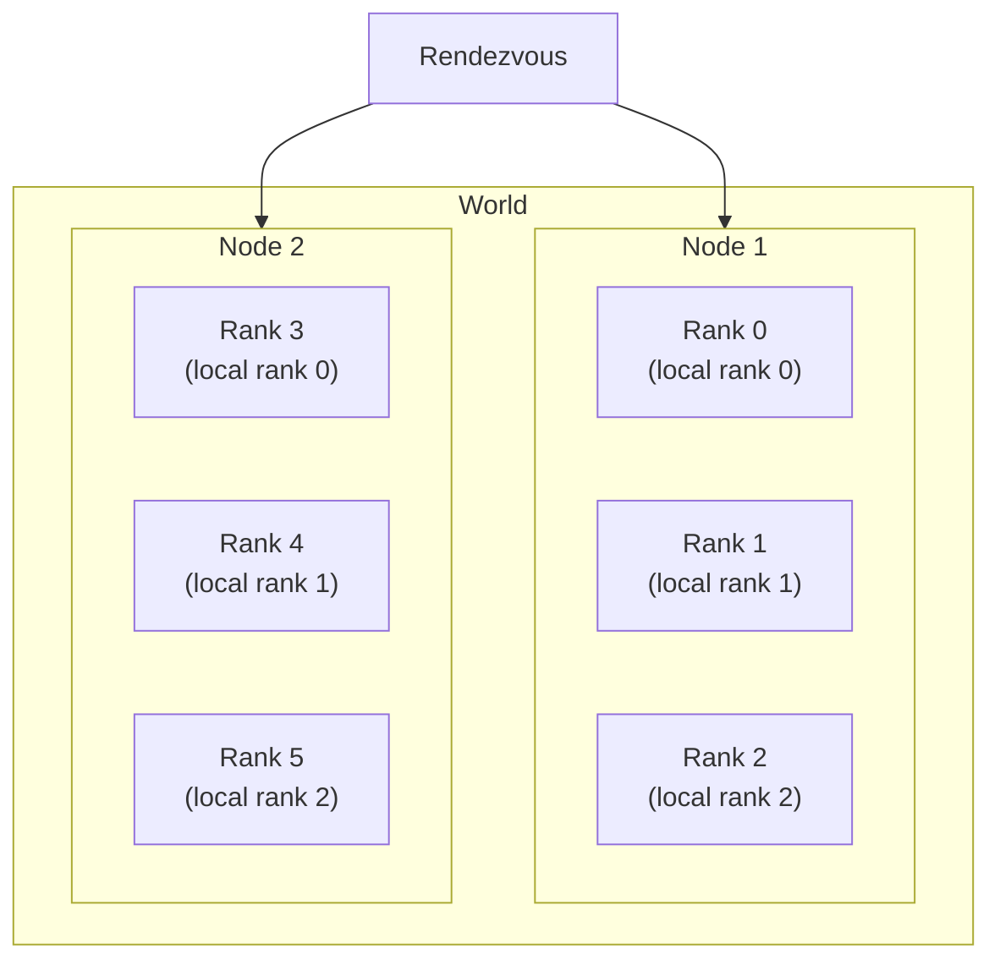
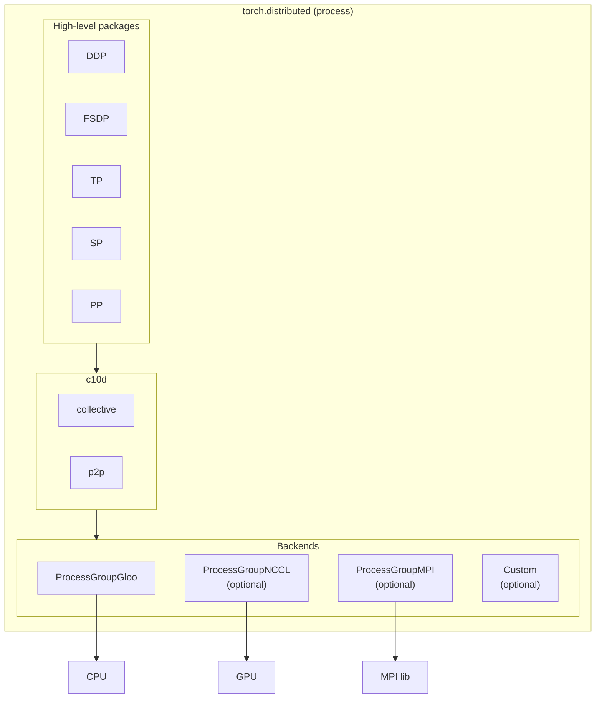
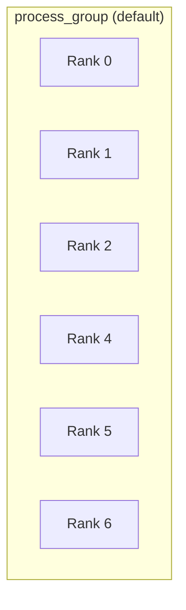
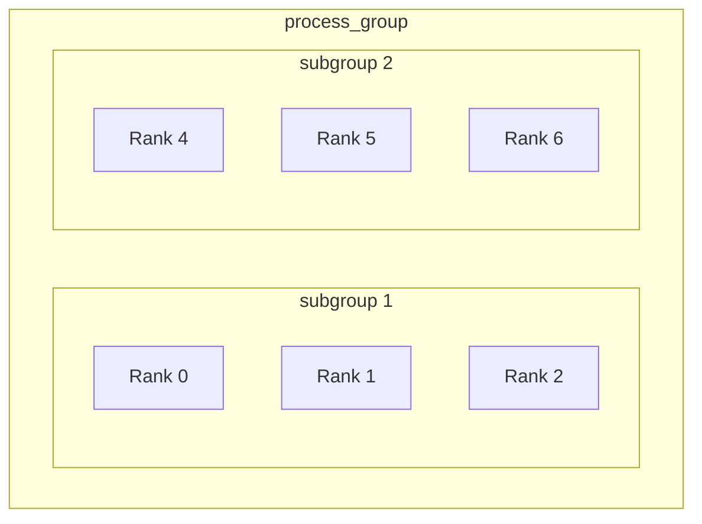

# Week 5: Distributed Programming in Pytorch

Pytorch + NPU 온라인 모임 #5 | 2025-01-15

<div class="abs-tl m-6">
  <span @click="$slidev.nav.go(1)" class="cursor-pointer opacity-50 hover:opacity-100 text-sm">
    ← 목차로 돌아가기
  </span>
</div>

---
level: 2
---

# Where We Are

<div class="grid grid-cols-2 gap-4 mt-4">
<div>

**원래 계획**

- Pytorch internal: 기초 (3회)
  - Pytorch internal에 대한 개요
  - Pytorch eager mode
  - Pytorch graph mode
  - Putting things together
- Pytorch internal: 심화 (8회)
  - Pytorch + Nvidia GPU
  - Pytorch + parallelism
  - Pytorch + LLM + inference
  - Pytorch + 리벨리온 NPU

</div>
<div>

**현재 계획**

- Week 1: 기술적인 배경
- Week 2: eager mode
- Week 3: graph mode
- Week 4: automatic differentiation
- **Week 5: distributed programming**
- Week 6: beyond Pytorch: custom kernel과 vLLM
- Week 7: CPU / GPU / NPU
- Week 8: 리벨리온 NPU

</div>
</div>

<!--
지금까지 진행한 내용: 기술적 배경(1주차), Eager 모드(2주차), Graph 모드(3주차), Autograd(4주차), 분산 프로그래밍(이번 주, 5주차). PyTorch 내부 기능들은 이번 주로 마무리할 예정. 다음 주(6주차)부터는 Beyond PyTorch를 다루며, Custom Kernel과 vLLM을 다룰 예정. 7주차부터는 하드웨어 초점으로 진행.
-->

---
level: 2
---

# Pytorch 2.0 (from Week #1)

- NumPy-like experience
- Heterogeneous computing as an underneath foundation
- <span class="text-orange-400 font-bold">MPI-like distributed programming model</span>
- Integration with compute libraries / ML compiler
- Three language layers: Python → C++ → kernel language (ex: CUDA, Triton)
- Define-by-run /w graph capturing with TorchDynamo
  - Support both training and inference
- Various backend integration points
  - Eager mode
    - As a new dispatch target
  - Graph mode
    - Both JIT (and AOT)
    - As a backend to TorchDynamo
    - As a backend to Inductor

<!--
PyTorch 2.0의 주요 특성 중 오늘은 MPI와 비슷한 PyTorch의 distributed programming 모델에 대해서 이야기를 나눠볼 예정.
-->

---
level: 2
---

# Outline

<div class="mt-4">

- <span class="text-orange-400 font-bold border border-orange-400 border-dashed px-2 py-1">Overview</span>
- torchrun을 활용한 distribute matmul 예제
- Device와 연결: CUDA 예제
- Pytorch가 제공하는 모델 병렬화 패키지들

</div>

<!--
크게 네 부분으로 나눠서 설명할 예정. 전반적인 오버뷰, torchrun을 활용한 예제, CUDA와의 연결, 그리고 PyTorch가 제공하는 병렬화 패키지들.
-->

---
level: 2
---

# MPI vs OpenMP

<div class="grid grid-cols-2 gap-4 mt-4">
<div class="text-center">

**MPI**


Distributed Memory

</div>
<div class="text-center">

**OpenMP**


Shared Memory

</div>
</div>

<div class="mt-4">

- **OpenMP**: Shared Memory 모델 기반 → 모든 프로세서가 동일한 메모리에 접근 가능
- **MPI**: Distributed Memory 모델 기반 → 프로세서 간 메시지 전달을 통해 통신
- **PyTorch**는 MPI 스타일을 따름 (Distributed Memory 방식)

</div>

<!--
병렬 프로그래밍 모델에서 대표적인 두 가지: MPI(Message Passing Interface)와 OpenMP(Open Multi-Processing). OpenMP는 Shared Memory 모델 기반으로 모든 프로세서가 동일한 메모리에 접근 가능하고, MPI는 Distributed Memory 모델 기반으로 프로세서 간 직접적인 메모리 접근 없이 메시지 전달을 통해 통신. PyTorch는 MPI 스타일을 따름.
-->

---
level: 2
---

# MPI vs OpenMP: Task 구성 방식

<div class="grid grid-cols-2 gap-4 mt-4">
<div class="text-center">

**MPI**


독립적인 프로세스들의 묶음

</div>
<div class="text-center">

**OpenMP**


Master-Worker (Fork-Join) 모델

</div>
</div>

<div class="mt-4 text-sm">

- **MPI**: 각 프로세스가 독립적으로 시작, 메시지 패싱으로 통신, Barrier를 통한 동기화
- **OpenMP**: Master 태스크가 시작 → Fork (병렬 태스크 생성) → Join (종료) → 반복

</div>

<!--
MPI는 독립적인 프로세스들이 모여서 동작하는 방식. 모든 프로세스는 각자 독립적으로 시작하고, 메시지 패싱과 Barrier를 통해 통신. OpenMP는 Master-Worker 모델로 Fork-Join 패턴을 기반으로 병렬 태스크를 실행.
-->

---
level: 2
---

# MPI 프로그램 구조

<div class="grid grid-cols-2 gap-4 mt-4">
<div>


</div>
<div class="flex flex-col justify-center">

- MPI 프로그램은 여러 프로세스에서 **동일한 프로그램**을 실행
- 각 프로세스는 **초기화(initialization)** 수행 후 병렬로 작업
- rank에 따라 다르게 동작하도록 코드 작성
- 모든 작업이 완료되면 **finalize** 단계를 거쳐 종료
- **PyTorch도 이러한 구조와 유사한 패턴을 따름**

</div>
</div>

<!--
MPI 프로그램은 일반적으로 여러 프로세스에서 동일한 프로그램을 실행하는 방식으로 구성. 각 프로세스는 초기화를 수행한 후 병렬로 작업을 수행하고, rank에 따라 다르게 동작하도록 코드가 작성됨. PyTorch도 이러한 구조와 유사한 패턴을 따름.
-->

---
level: 2
---

# Pytorch Distributed Programming: Concept

<div class="grid grid-cols-2 gap-4 mt-4">
<div>

<v-clicks>

- **Node**: A physical instance (with one or several GPUs)
- **Process**: spawned from each node, 1 process : 1 GPU
- **World**: processes for the job
- **Rank**
  - global: in World
  - local: in Node
- **Rendezvous**: gathering participants(nodes) of a training job, dynamically manageable

</v-clicks>

</div>
<div>



</div>
</div>

<!--
PyTorch의 분산 프로그래밍 모델은 MPI의 프로세스 개념과 유사. 노드(node)는 여러 개의 프로세스를 실행할 수 있는 단위이고, 월드(world)는 모든 노드와 프로세스를 포함하는 전체 계산 범위. 랭크(rank)는 글로벌 랭크(전체 분산 환경에서의 프로세스 순서)와 로컬 랭크(한 노드 내에서의 프로세스 구분)가 있음. Rendezvous를 사용하여 어떤 머신들이 task에 참여할지 결정.
-->

---
level: 2
---

# Overall Architecture



<!--
PyTorch 분산 처리 구조: 맨 아랫단에 communication backend(Gloo, NCCL, MPI)가 있고, 그 위에 c10d(distributed communication core layer)가 있어 collective/p2p API 인터페이스를 제공. 최상위에 DDP, FSDP, TP 등 모델 병렬화 패키지들이 위치.
-->

---
level: 2
---

# Process Group

**A collection of processes which communicate with each other**

<div class="grid grid-cols-2 gap-4 mt-4">
<div>

**Default process_group**



</div>
<div>

**process_group with 2 subgroups**



</div>
</div>

<!--
프로세스 그룹은 통신을 위한 구성 단위. 전체 월드를 하나의 프로세스 그룹으로 표현하거나, 서브 프로세스 그룹을 가질 수 있어 계층적(hierarchical) 구조가 가능. 이를 통해 다양한 방식으로 프로세스를 묶어 통신을 수행할 수 있음.
-->

---
level: 2
---

# Distributed Communication Layer (c10d)

Pytorch에서 제공하는 **distributed communication API**에 해당

<div class="mt-4">

- 2가지 그룹으로 나눌 수 있음
  - **Collective communication**
    - group 내에 있는 모든 process들이 협력하여 data를 공유/처리
    - 대부분의 PyTorch 패키지에서 주로 활용됨
  - **P2P communication**
    - 하나의 process에서 다른 process로 data 전송
    - 개별 프로세스 간 직접적인 데이터 교환이 필요할 때 사용

</div>

<!--
PyTorch의 c10d는 분산 커뮤니케이션의 핵심 backbone 역할. Collective Communication(집합적 통신)은 여러 프로세스가 동시에 데이터를 공유하거나 처리할 때 사용되며, P2P Communication은 개별 프로세스 간 직접적인 데이터 교환에 사용됨. MPI, NCCL, Gloo 같은 백엔드를 통해 구현.
-->

---
level: 2
---

# Collective Communication: Scatter / Gather

<div class="mt-2">

- **Scatter**: 데이터를 여러 프로세스에 분산
- **Gather**: 여러 프로세스의 데이터를 한 곳으로 모음

</div>


<div class="text-sm text-center mt-2">

https://pytorch.org/tutorials/intermediate/dist_tuto.html

</div>

---
level: 2
---

# Collective Communication: Reduce / All-Reduce

<div class="mt-2">

- **Reduce**: 여러 프로세스의 데이터를 하나로 합침
- **All-Reduce**: 여러 프로세스에서 데이터 연산 후 결과를 모두에게 공유

</div>


<div class="text-sm text-center mt-2">

https://pytorch.org/tutorials/intermediate/dist_tuto.html

</div>

---
level: 2
---

# Collective Communication: Broadcast / All-Gather

<div class="mt-2">

- **Broadcast**: 한 프로세스의 데이터를 모든 프로세스에 전달
- **All-Gather**: 모든 프로세스의 데이터를 모든 프로세스에 수집

</div>


<div class="text-sm text-center mt-2">

https://pytorch.org/tutorials/intermediate/dist_tuto.html

</div>

---
level: 2
---

# Communication Backends

- **c10d는 interface만 제공**
  - 실제 동작은 개별 HW에 대한 communication backend에 구현

<div class="mt-4">

| Backend | 지원 Device | 비고 |
|---------|------------|------|
| **Gloo** | CPU / GPU | CPU 분산 학습에 주로 사용 |
| **NCCL** | GPU | NVIDIA GPU 전용, GPU 간 통신 최적화 |
| **MPI** | CPU | 일반적인 클러스터 분산 환경 |

</div>

- Third-party backend는 `c10d/Backend.hpp`를 구현해야 함
  - **21개 virtual function**으로 구성: `broadcast`, `allreduce`, `reduce`, `allgather`, ...

<!--
c10d 자체는 통신 API를 제공하는 인터페이스일 뿐, 실제 통신 로직을 구현하지 않음. 구체적인 통신은 Communication Backend에서 처리됨. PyTorch에서 주로 Gloo(CPU)와 NCCL(GPU)가 사용됨. backend.hpp에 정의된 약 21개의 virtual function들을 구현해야 함.
-->

---
level: 2
---

# Outline

<div class="mt-4">

- ~~Overview~~
- <span class="text-orange-400 font-bold border border-orange-400 border-dashed px-2 py-1">torchrun을 활용한 distribute matmul 예제</span>
- Device와 연결: CUDA 예제
- Pytorch가 제공하는 모델 병렬화 패키지들

</div>

<!--
지금까지 PyTorch의 distributed 패키지가 어떻게 구성되어 있는지 살펴봤고, 이제 실제 사례로 torchrun을 통해 어떻게 동작하는지 살펴볼 예정.
-->

---
level: 2
---

# torchrun

Pytorch 분산 프로그래밍에서 각 node가 수행할 일을 template화한 **utility script**

각 node(physical instance)에서 argument를 설정하여 torchrun을 실행

```bash
torchrun --nnodes=2 --nproc_per_node=8 \
    --rdzv_id=job1 --rdzv_backend=c10d \
    --rdzv_endpoint=node1:29500 \
    dist_matmul_allreduce.py
```

<div class="mt-4 text-sm">

| 파라미터 | 설명 |
|---------|------|
| `nnodes` | 참여하는 node의 개수 |
| `nproc_per_node` | node당 process의 개수 |
| `node_rank` | node ID |
| `--rdzv-backend` | rendezvous backend |
| `--rdzv-endpoint` | rendezvous host:port |
| `test.py` | 각 process가 실행할 pytorch 코드 |

</div>

<!--
torchrun은 PyTorch에서 기본 제공하는 분산 프로그램 실행을 위한 Top-level script. 반드시 사용해야 하는 것은 아니며, 필요한 기능을 조합하여 유사한 스크립트를 만들 수도 있음. 각 노드에서 torchrun을 실행하면 해당 노드들이 공동 작업을 수행하게 됨.
-->

---
level: 2
---

# torchrun을 시작하기 전 준비 단계

**클러스터 설정**

<v-clicks>

- SSH기반 설정 (가장 단순)
  - `/etc/hosts`에 클러스터의 모든 노드의 IP와 hostname을 등록
  - 모든 노드들 사이에 암호없이 로그인이 가능하도록 세팅
- Ray cluster
- Kubernetes
- Slurm workload manager
- Horovod

</v-clicks>

<div class="mt-4">

**설명에 사용할 예제 클러스터**
- GPU가 8개씩 달려 있는 두 개의 노드
  - `192.168.0.2` (node_rank 0)
  - `192.168.0.3` (node_rank 1)

</div>

<!--
torchrun을 실행하기 전에 클러스터 설정이 필요. SSH를 이용한 수동 설정이나 Ray, Slurm, Horovod 등의 분산 클러스터 관리 패키지를 사용할 수 있음.
-->

---
level: 2
---

# torchrun를 시작

각 노드에서 다음과 같이 실행한다.

**@ node_rank: 0**

```bash
$ torchrun --nnodes=2 --nproc_per_node=8 --node_rank=0 \
    --rdzv_id=job1 --rdzv_backend=c10d \
    --rdzv_endpoint="192.168.0.2:29500" \
    dist_matmul_allreduce.py
```

**@ node_rank: 1**

```bash
$ torchrun --nnodes=2 --nproc_per_node=8 --node_rank=1 \
    --rdzv_id=job1 --rdzv_backend=c10d \
    --rdzv_endpoint="192.168.0.2:29500" \
    dist_matmul_allreduce.py
```

<!--
클러스터가 준비되면 각 노드에서 torchrun을 실행하면 됨. 각 노드에서 여러 개의 프로세스를 실행할 경우, 랭크를 변경하면서 여러 번 실행하면 됨. 중요한 파라미터들을 설정한 후 torchrun을 실행하면 각 프로세스가 실행되면서 전체적인 분산 학습이 시작됨.
-->

---
level: 2
---

# torchrun 수행 중 일어나는 일

<div class="text-sm">

<v-clicks>

1. **torchrun 명령어 인자 parsing 및 초기화**
2. **프로세스 생성**: python process
   - 각 노드에서 `nproc_per_node`만큼의 python process를 생성
3. **랑데뷰 (rendezvous)**
   - 랑데뷰 초기화
   - 프로세스 발견 및 동기화
   - 프로세스마다 global rank 할당
4. **Process별로 pytorch 스크립트 실행**
   - 프로세스 그룹 생성하면서 communication backend를 선택 (nccl 혹은 gloo)
   - 데이터 로딩 및 쪼개기 (sharding)
   - 계산
   - `torch.distributed.all_reduce`를 이용한 동기화 (sync)
   - 프로세스 그룹 제거
5. **부가 기능**: fault tolerance (w/ checkpointing and logging)
   - `--max-restarts=N`: 실패 시 N번까지 재시작 시도

</v-clicks>

</div>

<!--
torchrun이 실행되면 명령 처리 및 초기화, Python 프로세스 실행, Rendezvous 초기화, 클러스터 구성 후 PyTorch 실행 순서로 진행. PyTorch 실행 패턴은 MPI와 유사한 구조: 통신 백엔드 선택 및 생성, 데이터 로딩 및 분할, 모델 학습 및 계산 수행, 동기화, 프로세스 그룹 제거.
-->

---
level: 2
---

# torchrun 수행 중 일어나는 일: 랑데뷰 (rendezvous)

각 프로세스에서 pytorch 스크립트 실행 전에 다음과 같은 것들을 해준다.

<v-clicks>

- 랑데뷰 instance가 만들어지고 IPC를 위해서 c10d backend를 초기화
  - Pytorch의 `DynamicRendezvousHandler` class를 사용
  - `rdzv-endpoint`로 지정된 노드에서 rendezvous backend가 생성되어 hosting
- 랑데뷰 endpoint에 연결
- 모든 프로세스가 join하는 것을 기다림
- 각 프로세스에 고유한 rank를 할당
- 모든 프로세스에서 consistent한 distributed environment를 세팅
- 모든 프로세스가 준비가 되면 pytorch script를 실행하기 시작
- **fault tolerance**: 한 노드가 실패하면 남아 있는 다른 노드에서 랑데뷰를 다시 시도

</v-clicks>

<!--
Rendezvous는 분산 계산에 참여할 머신들의 집합을 구성하고 정보를 공유하는 과정. IPC를 위한 c10d 백엔드 초기화, Rendezvous Endpoint에 연결, 모든 프로세스가 Join할 때까지 대기, 각 프로세스에 랭크를 할당하고 실행 준비 완료. 이 과정이 완료되면 PyTorch의 분산 환경이 설정되고 각 프로세스에서 학습이 시작됨.
-->

---
level: 2
---

# torchrun 수행 중 일어나는 일: Task 수행 (1)

```python
if __name__ == "__main__":
    rank = int(os.environ.get("RANK"))
    if rank == 0:
        A, B = torch.ones(n, n), torch.ones(n, n)
    else:
        A, B = torch.empty(n, n), torch.empty(n, n)

    result = dist_matmul_allreduce(
        A, B,
        int(os.environ.get("LOCAL_RANK")),
        int(os.environ.get("WORLD_SIZE")))

    if rank == 0:
        print(result)
```

- **Rank 0** 프로세스가 초기 데이터를 로드하고, 다른 프로세스에 분배
- 각 프로세스에서 `dist_matmul_allreduce` 함수로 분산 행렬 연산 수행
- **Rank 0**에서 최종 결과를 모아 출력

<!--
Rendezvous가 완료되면 torchrun은 PyTorch를 실행하여 본격적인 작업을 수행. Rank 0 프로세스와 기타 프로세스의 역할이 구분되며, dist_matmul_allreduce 함수에서 각 프로세스의 작업이 수행됨.
-->

---
level: 2
---

# torchrun 수행 중 일어나는 일: Task 수행 (2)

<div class="grid grid-cols-2 gap-4">
<div>

```python
def dist_matmul_allreduce(
        A, B, local_rank, world_size):
    torch.cuda.set_device(local_rank)
    dist.init_process_group(backend="nccl")
    dist.broadcast(A, 0)
    dist.broadcast(B, 0)
    local_A, local_B = distributed_data(
        A, B, local_rank, world_size)
    local_result = local_matmul(
        local_A, local_B)
    dist.all_reduce(
        local_result, op=dist.ReduceOp.SUM)
    dist.destroy_process_group()
    return local_result
```

</div>
<div>

```python
def distributed_data(A, B, lrank, world_size):
    n = 16000
    k = n // world_size
    device = torch.device(f"cuda:{lrank}")
    # split A and B
    local_A = A[:, lrank*k:(lrank+1)*k].to(
        device)
    local_B = B[lrank*k:(lrank+1)*k, :].to(
        device)
    return local_A, local_B

def local_matmul(local_A, local_B):
    return torch.matmul(local_A, local_B)
```

</div>
</div>

<!--
dist_matmul_allreduce 함수의 내부 구조: Local Rank를 기반으로 사용할 디바이스 설정, Backend 설정(NCCL), 데이터 broadcast 후 각 rank에 맞게 분배, local_matmul로 행렬 곱셈 수행, all_reduce로 결과 합산, destroy_process_group으로 정리.
-->

---
level: 2
---

# Outline

<div class="mt-4">

- ~~Overview~~
- ~~torchrun을 활용한 distribute matmul 예제~~
- <span class="text-orange-400 font-bold border border-orange-400 border-dashed px-2 py-1">Device와 연결: CUDA 예제</span>
- Pytorch가 제공하는 모델 병렬화 패키지들

</div>

<!--
지금까지 torch.distributed 패키지의 구조와 torchrun 예제를 살펴봤고, 이제 CUDA 및 NCCL과의 연결에 대해 알아볼 예정.
-->

---
level: 2
---

# CUDA와의 접점

```python {all|3|4|5-6|7-8|9|10}
def dist_matmul_allreduce(A, B, local_rank, world_size):
    # 1. CUDA Device 선택
    torch.cuda.set_device(local_rank)
    # 3. Process Group 생성 및 통신 채널 설정
    dist.init_process_group(backend="nccl")
    dist.broadcast(A, 0)
    dist.broadcast(B, 0)
    local_A, local_B = distributed_data(A, B, local_rank, world_size)
    local_result = local_matmul(local_A, local_B)
    # 2. 동기화 (CUDA Runtime)
    dist.all_reduce(local_result, op=dist.ReduceOp.SUM)
    # 4. Process Group 제거
    dist.destroy_process_group()
    return local_result
```

- **1. CUDA Device 선택** / **2. 동기화 (CUDA runtime)** / **3. Process Group 생성** / **4. Process Group 제거**

<!--
dist_matmul_allreduce 함수에서 CUDA와 NCCL이 연결되는 포인트: GPU 및 백엔드 설정, distributed broadcast는 NCCL을 통한 collective communication, dist.all_reduce는 CUDA 인터페이스를 통해 수행, 프로세스 종료 과정에서도 CUDA와 상호작용.
-->

---
level: 2
---

# 1: CUDA Device 선택

- `torch.cuda.set_device()`를 통해 명시적인 device 선택
  - Rendezvous에서 지정해 준 `LOCAL_RANK` 환경변수를 사용
    - 하나의 node 내에서만 unique한 rank (`RANK` 환경변수가 global unique)
    - 이를 통해 node 내에서 **process : device == 1 : 1** 관계를 만듦
  - `torch.distributed.init_process_group()`을 호출하기 전에 수행되어야 함
    - 명시적으로 어떤 device를 사용할 것인지 지정 필요
    - 지정하지 않으면 0번 device가 사용됨
  - `torch.cuda.set_device()`를 호출하는 것만으로는 CUDA 초기화가 발생하지 않음
    - **lazy한 초기화**: Tensor를 최초로 만들 때에 초기화가 일어남

<div class="mt-4 text-sm">

| | 0 | 1 | ... | 7 | | 8 | 9 | ... | 15 |
|---|---|---|---|---|---|---|---|---|---|
| **RANK** | 0 | 1 | ... | 7 | | 8 | 9 | ... | 15 |
| **LOCAL_RANK** | 0 | 1 | ... | 7 | | 0 | 1 | ... | 7 |

</div>

---
level: 2
---

# 2: 동기화 (CUDA Runtime)

<div class="grid grid-cols-2 gap-4">
<div>

- `torch.distributed.all_reduce()` in world
  - PyTorch의 ProcessGroup C++ binding으로 전달됨
    - 초기화된 ProcessGroup을 확인하고, NCCL backend를 사용하는지 확인
  - ProcessGroupNCCL에서 AllReduce
    - NCCLComm 객체를 사용하여 NCCL 통신을 준비
    - NCCL library의 `ncclAllReduce()` 함수를 호출

</div>
<div>

```python
# non-blocking all_reduce() 예시
work = dist.all_reduce(
    local_result,
    op=dist.ReduceOp.SUM,
    async_op=True
)
do_something()
work.wait()
```

```python
# torch/distributed/distributed_c10d.py
def all_reduce(tensor, op=ReduceOp.SUM,
               group=None, async_op=False):
    ...
    work = group.allreduce([tensor], opts)
    if async_op:
        return work
    else:
        work.wait()
```

</div>
</div>

---
level: 2
---

# 3: Process Group 생성 및 통신 채널 설정

`torch.distributed.init_process_group()`에서 통신 채널을 생성

- NCCL(GPU), GLOO(GPU/CPU), MPI(CPU) 등의 backend를 지정
- 초기화 방법(init_method)도 지정 가능
- timeout, world size, rank 등의 metadata를 여기서 설정

<div class="grid grid-cols-2 gap-4 mt-4">
<div>

```python
# 주소를 직접 명시한 초기화
dist.init_process_group(
    backend="nccl",
    init_method='tcp://127.0.0.1:23456',
    world_size=world_size,
    rank=rank
)
```

</div>
<div>

```python
# 공유 filesystem을 통한 초기화
dist.init_process_group(
    backend="nccl",
    init_method='file:///mnt/nfs/sharedfile',
    world_size=world_size,
    rank=rank
)
```

</div>
</div>

---
level: 2
---

# 3: Process Group 생성 및 통신 채널 설정 (계속)

`torch.distributed`가 Rendezvous를 통해 server/client 정보를 수집

- 환경변수를 참고해 정보 수집: `MASTER_ADDR`, `MASTER_PORT`, `WORLD_SIZE`, `RANK`
- 수집한 정보로 **TCPStore**를 생성함으로써 UNIX process간 통신 환경 준비
  - rank == 0인 경우에만 daemon을 생성, 나머지는 daemon에 connect

```python
# torch/distributed/rendezvous.py
if "rank" in query_dict:
    rank = int(query_dict["rank"])
else:
    rank = int(_get_env_or_raise("RANK"))
if "world_size" in query_dict:
    world_size = int(query_dict["world_size"])
else:
    world_size = int(_get_env_or_raise("WORLD_SIZE"))
master_addr = _get_env_or_raise("MASTER_ADDR")
master_port = int(_get_env_or_raise("MASTER_PORT"))
use_libuv = _get_use_libuv_from_query_dict(query_dict)
store = _create_c10d_store(
    master_addr, master_port, rank, world_size, timeout, use_libuv
)
```

---
level: 2
---

# 4: Process Group 제거

**`torch.distributed.destroy_process_group()`**

- 통신 자원 해제 및 memory 등의 resource 정리가 일어남
- group에 참여했던 **모든 process들이 이를 호출해야** 비로소 종료될 수 있음
- **collective operation처럼 동작**하므로 모두가 이를 수행할 때까지 block
- NCCL backend의 경우
  - 내부적으로 NCCLComm이 소멸되면서
  - `ncclCommDestroy()`를 호출하여 GPU 간 통신에 사용된 resource를 정리

---
level: 2
---

# Outline

<div class="mt-4">

- ~~Overview~~
- ~~torchrun을 활용한 distribute matmul 예제~~
- ~~Device와 연결: CUDA 예제~~
- <span class="text-orange-400 font-bold border border-orange-400 border-dashed px-2 py-1">Pytorch가 제공하는 모델 병렬화 패키지들</span>

</div>

<!--
CUDA backend가 c10d 뒤에 붙게 되면 디바이스들이 병렬로 큰 모델을 처리할 수 있게 됨. 이제 병렬 패키지들을 간단하게 살펴볼 예정.
-->

---
level: 2
---

# Pytorch가 제공하는 모델 병렬화 패키지들

<div class="text-sm">

**Distributed Data Parallel (DDP)**
- 동일한 모델을 여러 개 복제하여 병렬로 학습 → **Data Parallel** 방식

**Fully Sharded Data Parallel (FSDP)**
- parameter(weight, bias)를 world_size로 나누어서 GPU에 sharding하고 저장
- 동작방식: before computation → **unsharding** (all_gather) → computation → **resharding**

**Tensor Parallel (TP)**
- parameter를 row parallel / column parallel 방식으로 GPU에 sharding
- 동작방식: input/parameter가 plan에 맞게 개별 GPU에 할당 → computation → output 합산

**Sequence Parallel (SP)** / **Pipeline Parallel (PP)**

</div>

<!--
DDP는 동일한 모델을 여러 벌 만들어 throughput을 높이는 Data Parallel 방식. FSDP는 모델이 너무 커서 한 머신에 수용할 수 없을 때 weight를 여러 머신에 shard하여 저장하고, 연산 시 필요한 weight를 불러와 수행. Tensor Parallel은 weight뿐 아니라 연산 자체도 여러 머신에서 나누어 처리. 이 패키지들은 Python의 동적 클래스 생성을 이용하여 모델을 래핑하는 방식으로 구현됨.
-->

---
level: 2
---

# FSDP: Example Code

<div class="grid grid-cols-2 gap-4">
<div>

```python
class Net(nn.Module):
    def __init__(self):
        super(Net, self).__init__()
        self.conv1 = nn.Conv2d(1, 32, 3, 1)
        self.conv2 = nn.Conv2d(32, 64, 3, 1)
        self.dropout1 = nn.Dropout(0.25)
        self.dropout2 = nn.Dropout(0.5)
        self.fc1 = nn.Linear(9216, 128)
        self.fc2 = nn.Linear(128, 10)

    def forward(self, x):
        x = self.conv1(x)
        x = F.relu(x)
        x = self.conv2(x)
        x = F.relu(x)
        x = F.max_pool2d(x, 2)
        x = self.dropout1(x)
        x = torch.flatten(x, 1)
        x = self.fc1(x)
        x = F.relu(x)
        x = self.dropout2(x)
        x = self.fc2(x)
        return F.log_softmax(x, dim=1)
```

</div>
<div>

```python
def fsdp_main(rank, world_size, args):
    setup(rank, world_size)
    ……
    model = Net().to(rank)
    model = FSDP(model)
    ……
```


<div class="text-xs mt-2">

(PyTorch FSDP: Experiences on Scaling Fully Sharded Data Parallel)

https://pytorch.org/tutorials/intermediate/FSDP_tutorial.html

</div>

</div>
</div>

<!--
FSDP 적용: 기본적으로 PyTorch 모델(Net 클래스)을 정의하고, FSDP를 사용하여 모델을 감싸서 새로운 모델 생성. Op 단위로 수행할 필요가 없는 경우 Op 그룹별로 weight를 샤딩할 수도 있어 통신 비용을 줄여 성능을 향상할 수 있음.
-->

---
level: 2
---

# FSDP: 내부동작

**Fully Sharded Data Parallel (FSDP)**

- **initialization**
  - FlatParameter 설정
    - 개별 process의 sharding 정보
    - sharded memory allocation
    - unsharded memory deallocation
  - Hook 등록
    - pre: `all_gather`
    - post: unsharding
- **forward**
  - each layer: `all_gather` → computation → unsharding
- **backward**
  - each layer: `all_gather` → computation → unsharding → `reduce_scatter`
    - (`_register_post_backward_hook`에서 등록)

---
level: 2
---

# Tensor Parallel: Example Code

<div class="grid grid-cols-2 gap-4">
<div>

```python
from torch.distributed.device_mesh \
    import init_device_mesh
from torch.distributed.tensor.parallel \
    import ColwiseParallel, \
           RowwiseParallel, \
           parallelize_module

tp_mesh = init_device_mesh("cuda", (8,))

layer_tp_plan = {
    "feed_forward.w1": ColwiseParallel(),
    "feed_forward.w2": RowwiseParallel(),
    "feed_forward.w3": ColwiseParallel(),
}

for layer_id, transformer_block \
        in enumerate(model.layers):
    layer_tp_plan = {...}
    parallelize_module(
        module=transformer_block,
        device_mesh=tp_mesh,
        parallelize_plan=layer_tp_plan,
    )
```

</div>
<div>


<div class="text-xs mt-2">

(Megatron-LM: Training Multi-Billion Parameter Language Models Using Model Parallelism)

https://pytorch.org/tutorials/intermediate/TP_tutorial.html

</div>

- 계산을 자동으로 쪼개지 않으며, 개발자가 **분할 계획(plan)**을 설계해야 함
- Megatron 등의 기존 기술을 활용하여 추상화

</div>
</div>

<!--
Tensor Parallel은 계산 자체를 쪼개서 병렬 수행하는 방식. 개발자가 모델의 특정 레이어에 대한 분할 계획(plan)을 설계해야 함. Megatron 등의 기존 기술을 활용하여 추상화되어 제공. Data Parallel은 가장 상위에 적용되고, TP와 PP는 모델 특성에 따라 적절한 조합이 필요.
-->

---
level: 2
---

# Next Week Preview: Beyond Pytorch

**Custom kernel**

- 두 가지 용처
  - 기존 op으로 cover되지 않은 새로운 op이 필요한 경우
  - Pytorch에서 제공하고 있는 op 성능이 부족한 경우
- 작성 방법
  - CUDA, cuBLAS, cuTLASS
  - Triton

**vLLM**

- vLLM의 구조
- vLLM이 제공하고 있는 최적화 기능들
- vLLM이 요구하는 custom op들

<!--
다음 주에는 PyTorch만으로 해결되지 않는 기능들을 다룰 예정. Custom Kernel 작성 방법(CUDA, Triton 등)과 vLLM 구조 및 최적화 기법을 살펴볼 예정. Attention 연산은 context length가 길어질수록 연산량이 증가하여 최적화가 중요하며, 새로운 GPU가 나올 때마다 커널을 재작성할 필요성이 있음(Flash Attention v1, v2, v3의 발전 과정).
-->

---
level: 2
layout: center
class: text-center
---

# 감사합니다
