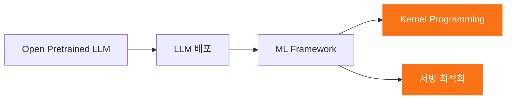
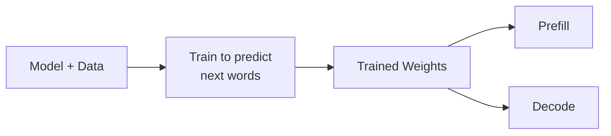

# Week 6: Beyond Pytorch: Custom Kernel과 vLLM

모두연 Pytorch + NPU 온라인 모임 #6 | 2025-02-05

<div class="abs-tl m-6">
  <span @click="$slidev.nav.go(1)" class="cursor-pointer opacity-50 hover:opacity-100 text-sm">
    ← 목차로 돌아가기
  </span>
</div>

---
level: 2
---

# Where We Are

<div class="grid grid-cols-2 gap-4 mt-4">
<div>

**원래 계획**

- Pytorch internal: 기초 (3회)
  - Pytorch internal에 대한 개요
  - Pytorch eager mode
  - Pytorch graph mode
  - Putting things together

- Pytorch internal: 심화 (8회)
  - Pytorch + Nvidia GPU
  - Pytorch + parallelism
  - Pytorch + LLM + inference
  - Pytorch + 리벨리온 NPU

</div>
<div>

**현재 계획**

- Week 1: 기술적인 배경
- Week 2: eager mode
- Week 3: graph mode
- Week 4: automatic differentiation
- Week 5: distributed programming
- **Week 6: beyond Pytorch: custom kernel과 vLLM**
- Week 7: CPU / GPU / NPU
- **Week 8: 리벨리온 NPU (마지막 강의)**

</div>
</div>

---
level: 2
---

# Key Questions Today

<div class="mt-8 space-y-6">

<v-click>

<div class="text-xl">

**AI 반도체 관점에서 Pytorch만 지원하면 되는가?**
특히 추론에 특화된 AI 반도체라면?

</div>

</v-click>

<v-click>

<div class="text-xl">

**성능 측면에서 LLM 추론의 핵심 이슈는?** 그 해결책은?

</div>

</v-click>

<v-click>

<div class="text-xl">

**개발자들이 해결책을 구현하기 위해 Pytorch면 충분한가?**

</div>

</v-click>

</div>

<!--
주제: AI 반도체 회사의 LLM 추론 개발 환경은 PyTorch만으로 충분한가?
핵심 답변: PyTorch는 LLM 추론 환경의 매우 중요한 핵심이지만, 전체 그림의 일부일 뿐이다.
오픈 소스 LLM (Llama, DeepSeek 등), Hugging Face 중심의 배포 기술도 중요하다.
성능 측면에서 PyTorch만으로는 해결되지 않는 부분이 많다.
커널 프로그래밍, 고수준 서빙 최적화 또한 필수적이다.
-->

---
level: 2
---

# LLM 추론 관점에서 PyTorch는 큰 그림의 일부

<div class="flex justify-center mt-4">



</div>

<div class="grid grid-cols-4 gap-2 mt-8 text-center text-sm">
<div>

**Open Pretrained LLM**

Llama, DeepSeek, ...

</div>
<div>

**LLM 배포**

Hugging Face, ...

</div>
<div>

**ML Framework**

PyTorch, ...

</div>
<div class="border border-orange-400 border-dashed p-2 rounded">

**오늘의 초점**

Kernel Programming + 서빙 최적화

</div>
</div>

<!--
LLM 추론 인프라의 성능 문제점을 분석하고, 해결을 위한 기술 동향을 살펴봅니다.
핵심 기술: 커널 프로그래밍(Why to), 서빙 최적화 프레임워크(Why to)
-->

---
level: 2
---

# Today's Agenda

<div class="mt-4">

- <span class="text-orange-400 font-bold border border-orange-400 border-dashed px-2 py-1">LLM inference의 성능 문제</span>
  - Prefill vs decode
  - Roofline analysis
  - Memory wall
- Memory overhead를 줄이기 위한 기술들
  - Continuous batching / Speculative decoding
  - Attention 최적화: Flash Attention, Paged Attention
  - Quantization / sparsity
- Kernel Programming
  - CUDA / cuTLASS / OpenAI Triton
- Serving 최적화 Framework
  - vLLM / Other proprietary frameworks

</div>

---
level: 2
---

# Self Attention and Scaled Dot-Product

<div class="grid grid-cols-2 gap-4 mt-2">
<div>
  
  <div class="text-sm text-center mt-2">모든 단어의 kv값과 특정 단어의 query를 사용</div>
</div>
<div>
  
  <div class="text-sm mt-2">

  1. "it"의 query가 모든 k에 반영
  2. 단어별로 qk와 v를 곱함
  3. 모든 단어의 영향을 더함
  4. Self-attention이 반영된 새로운 embedding

  </div>
</div>
</div>

<div class="text-sm mt-2 text-gray-400">하단 레이어는 병렬처리 가능 | Softmax 등 상위 연산은 병렬화가 까다로움</div>

<!--
Self-Attention은 K, V, Q 값을 사용하여 Scaled Dot-Product 연산을 수행합니다.
K, Q, V 값 계산은 병렬적으로 처리 가능하지만, Softmax와 Summation은 전체 분포를 고려해야 하므로 병렬 처리가 까다롭습니다.
-->

---
level: 2
---

# Non-Causal vs. Causal

<div class="grid grid-cols-2 gap-8 mt-4">
<div class="text-center">
  
  <p class="mt-2 font-bold">Non-Causal Attention</p>
  <p class="text-sm text-gray-400">앞/뒤 모든 단어를 고려 (양방향)</p>
</div>
<div class="text-center">
  
  <p class="mt-2 font-bold">Causal Attention</p>
  <p class="text-sm text-gray-400">이전 단어만 고려 (단방향)</p>
</div>
</div>

<div class="mt-4 text-center text-sm">

GPT 등장 이후 대부분의 LLM은 **Causal Attention (Auto-regressive)**을 사용

</div>

<!--
Non-Causal: 특정 단어의 Attention 계산 시 앞/뒤 모든 단어를 고려합니다.
Causal: 해당 단어보다 먼저 나온 단어만 고려합니다.
GPT 이후 대부분의 LLM은 Causal Attention을 사용합니다.
-->

---
level: 2
---

# Decode-Only LLM = Repeatedly Predict Next Words

<div class="flex justify-center mt-4">



</div>

<div class="grid grid-cols-2 gap-8 mt-8">
<div>

**Prefill**
- 프롬프트를 이해하는 과정
- 첫 번째 토큰 생성까지

</div>
<div>

**Decode**
- 문장이 끝날 때까지 토큰을 반복 생성
- 실제 답변을 만들어내는 과정

</div>
</div>

<div class="text-center mt-4 text-sm bg-yellow-900/30 p-2 rounded">

Prefill과 Decode는 weight를 share하지만 **구조가 다른 모델**이라 생각할 수 있음

</div>

<!--
Decode-Only LLM은 주어진 단어들로부터 다음 단어를 예측하는 과정을 반복합니다.
Prefill: 프롬프트 처리 + 첫 번째 토큰 생성
Decode: 토큰을 반복적으로 생성 (문장 완료 시까지)
리벨리온의 경우 Prefill과 Decode를 별도로 컴파일하여 사용합니다.
-->

---
level: 2
---

# Decode-Only LLM = Prefill + Decode

<div class="flex justify-center mt-2">
  
</div>

<div class="grid grid-cols-2 gap-8 mt-4">
<div class="text-center">

**Prefill** - Digest the user prompt

**TTFT** (Time to First Token)

</div>
<div class="text-center">

**Decode** - Generate the answer

**TPS** (Tokens Per Second)

</div>
</div>

<div class="text-sm text-gray-400 mt-4">

Self-Attention 계산 시 고려해야 하는 이전 문맥이 점점 길어지므로, 이론적으로 스텝이 진행될수록 TPS가 감소합니다.

</div>

<!--
TTFT: 첫 번째 토큰이 생성될 때까지 걸리는 시간 (프리필 속도)
TPS: 초당 생성되는 토큰 수 (디코드 속도)
-->

---
level: 2
---

# Prefill vs. Decode

<div class="grid grid-cols-2 gap-4 mt-2">
<div>
  
  <div class="text-sm mt-1">

  **Prefill**: Prompt의 모든 단어에 대한 KV 값 생성 + 첫번째 word 생성

  </div>
  
  <div class="text-sm mt-1">

  **Decode**: 새로운 단어를 반복적으로 생성

  </div>
</div>
<div class="flex flex-col justify-center text-sm">

**Prefill** (병렬 처리 가능)
- 모든 프롬프트 토큰을 **동시에** 처리 가능
- 다음 단어가 이미 정해져 있으므로 이전 토큰 결과를 기다릴 필요 없음
- 배치 사이즈가 큰 계산과 유사

**Decode** (순차 처리)
- 이전 토큰이 완전히 처리되어야 다음 토큰 처리 가능
- 매 스텝마다 **하나의 토큰만** 생성

</div>
</div>

<!--
Prefill: 프롬프트 내 모든 단어가 이미 정해져 있으므로 병렬 처리 가능.
Decode: 이전 토큰 생성이 완료되어야 다음 토큰 생성을 시작할 수 있어 순차적 처리.
-->

---
level: 2
---

# Prefill vs. Decode: 병렬성 비교

<div class="flex justify-center items-center mt-4">

```
Prefill (Parallel)              Decode (Sequential)
┌───┐ ┌───┐ ┌───┐ ┌───┐       ┌───┐ ┌───┐
│ I │ │like│ │my │ │cat│       │ a │ │lot│
└─┬─┘ └─┬─┘ └─┬─┘ └─┬─┘       └─┬─┘ └─┬─┘
  │    │    │    │         │    │
  ▼    ▼    ▼    ▼         ▼ ──→ ▼
┌───┐ ┌───┐ ┌───┐ ┌───┐       ┌───┐ ┌───┐
│L1 │ │L1 │ │L1 │ │L1 │       │L1 │ │L1 │
└─┬─┘ └─┬─┘ └─┬─┘ └─┬─┘       └─┬─┘ └─┬─┘
  │    │    │    │         │    │
  ▼    ▼    ▼    ▼         ▼ ──→ ▼
┌───┐ ┌───┐ ┌───┐ ┌───┐       ┌───┐ ┌───┐
│L2 │ │L2 │ │L2 │ │L2 │       │L2 │ │L2 │
└───┘ └───┘ └───┘ └───┘       └───┘ └───┘
```

</div>

<div class="text-sm mt-4 text-center">

Prefill: 수직 방향(레이어 간)과 우상향(KV 전달) 의존성만 존재 → 횡적으로 **병렬 처리 가능**

Decode: 토큰 간 순차적 의존성 → **시퀀셜 처리**

</div>

<!--
Prefill에서 I, like, my, cat 각각의 처리를 병렬적으로 수행 가능.
Decode에서 cat → a, a → lot은 순차적 의존성이 있어 병렬 처리 불가.
-->

---
level: 2
---

# Roofline Analysis

<div class="flex justify-center mt-2">
  
</div>

<div class="grid grid-cols-2 gap-8 mt-4 text-sm">
<div class="text-center">

**Decode** = Memory Bound

Arithmetic Intensity 낮음 → 연산기가 남아있는데 데이터 전송 속도가 병목

</div>
<div class="text-center">

**Prefill** = Compute Bound

Arithmetic Intensity 높음 → 연산기를 최대한 활용

</div>
</div>

<!--
Roofline Analysis: 메모리 바운드 vs Compute 바운드를 시각적으로 보여주는 그래프.
Decode는 웨이트를 한 번 올려서 한 번만 계산하므로 Arithmetic Intensity가 낮고 메모리 바운드.
Prefill은 웨이트를 한 번 올려서 여러 토큰을 동시에 계산하므로 Arithmetic Intensity가 높고 Compute 바운드.
-->

---
level: 2
---

# Memory 성능은 오래된 문제

<div class="flex justify-center mt-4">
  
</div>

<div class="mt-4 text-center">

1998년 "Memory Wall" 논문 이후, 프로세서 성능은 연산 속도보다 **데이터 전송 속도**에 의해 결정된다는 사실이 알려짐

</div>

<!--
프로세서 설계 시 메모리 성능이 병목 현상을 일으키는 경우가 많습니다.
1998년 논문에서 "메모리 벽(Memory Wall)"이라는 용어가 처음 사용되었습니다.
-->

---
level: 2
---

# Memory Interface 기술은 발전하고 있으나...

<div class="flex justify-center mt-2">
  
</div>

<div class="text-sm text-gray-400 text-center mt-2">(Log2 Scale)</div>

<!--
HBM 등 새로운 메모리 인터페이스 기술을 통해 대역폭이 향상되고 있습니다.
-->

---
level: 2
---

# ...상대적인 Memory 성능 문제는 점점 더 심해지고 있음

<div class="flex justify-center mt-2">
  
</div>

<div class="mt-4 text-center">

하드웨어의 **연산 밀도(Computing Density)** 증가 속도가 메모리 인터페이스 발전 속도보다 훨씬 빠름

→ 메모리 대역폭(Memory Bandwidth)을 **효율적으로 사용**하는 것이 매우 중요

</div>

<!--
시간이 지날수록 프로세서에서 메모리 성능 문제는 더욱 심화됩니다.
따라서 메모리 대역폭을 효율적으로 사용하는 것이 매우 중요합니다.
-->

---
level: 2
---

# Today's Agenda

<div class="mt-4">

- LLM inference의 성능 문제
  - Prefill vs decode
  - Roofline analysis
  - Memory wall
- <span class="text-orange-400 font-bold border border-orange-400 border-dashed px-2 py-1">Memory overhead를 줄이기 위한 기술들</span>
  - Continuous batching / Speculative decoding
  - Attention 최적화: Flash Attention, Paged Attention
  - Quantization / sparsity
- Kernel Programming
  - CUDA / cuTLASS / OpenAI Triton
- Serving 최적화 Framework
  - vLLM / Other proprietary frameworks

</div>

<!--
디코드는 연산량이 적음에도 메모리 바운드 상태이므로, 메모리 비효율을 줄이기 위한 기술들이 활발히 연구되고 있습니다.
-->

---
level: 2
---

# 여러 Query를 병렬로 처리

<div class="flex justify-center mt-2">
  
</div>

<div class="mt-4 text-sm">

- **Static/Dynamic Batching**: 여러 요청을 묶어 Lock-Step으로 처리 → 가장 느린 요청까지 대기 필요
- **Continuous Batching** (Orca, 서울대 정병권 교수): 각 레이어 단계에서 동적으로 요청을 끼워 넣어 병렬 처리
  - 시퀀스 길이가 달라도 효과적 처리 가능
  - LLM 서빙의 **필수 기술**로 자리잡음

</div>

<!--
Continuous Batching: 각 레이어 단계에서 동적으로 요청들을 끼워 넣어 병렬 처리합니다.
오카(Orca): 서울대학교 정병권 교수님의 연구에서 제안된 컨티뉴어스 배칭 기법.
-->

---
level: 2
---

# 여러 Token을 병렬로 (Speculative하게) 생성

<div class="grid grid-cols-2 gap-4 mt-2">
<div>
  
</div>
<div>
  
</div>
</div>

<div class="mt-2 text-sm">

**Speculative Decoding**

1. **작은 모델**(Draft Model)로 여러 토큰의 초안 생성
2. **큰 모델**(Main Model)로 초안을 **병렬 검증** (Prefill과 유사)
3. 오류 발생 지점 이전 토큰만 Accept, 이후는 폐기 → 재시도

</div>

<div class="text-sm text-gray-400 mt-2">

한 요청 내에서 검증 과정을 통해 여러 토큰을 동시에 처리 가능

</div>

<!--
Speculative Decoding: 작은 모델로 초안을 생성하고, 큰 모델로 검증하여 병렬 처리 가능.
검증 단계는 어떤 토큰을 검증할지 이미 정해져 있으므로, Prefill처럼 병렬 처리가 가능합니다.
-->

---
level: 2
---

# Attention Is Expensive

<div class="grid grid-cols-2 gap-4 mt-4">
<div>
  
</div>
<div class="flex flex-col justify-center">

$$\text{Attention Complexity} = O(n^2)$$

여기서 $n$은 **sequence length**

- 마지막 토큰 처리 시 이전 **모든 토큰**으로부터 Attention 계산 필요
- $N$번 반복 → $O(N^2)$ 복잡도
- 시퀀스가 길어질수록 **메모리와 시간이 기하급수적 증가**

</div>
</div>

<!--
어텐션 연산은 시퀀스 길이가 길어질수록 O(N^2)의 복잡도를 가지게 됩니다.
-->

---
level: 2
---

# Flash Attention

<div class="grid grid-cols-2 gap-4 mt-2">
<div>
  
</div>
<div>
  
</div>
</div>

<div class="mt-4 text-sm">

- $O(N^2)$ 복잡도를 근본적으로 해결할 수는 없으나, **훨씬 효율적으로** 처리 가능
- 핵심 기법: **Tiling** + **Fusion**
  - 기존: 반복적으로 DRAM에서 읽기/쓰기 → 메모리 접근 오버헤드
  - Flash Attention: 데이터를 한 번 올리고, 계산 완료 후 한 번에 내보냄

</div>

<!--
FlashAttention은 타일링과 퓨전 기술을 사용하여 메모리 접근 횟수를 줄입니다.
-->

---
level: 2
---

# Paged Attention

<div class="flex justify-center mt-2">
  
</div>

<div class="mt-4 text-sm">

- 문제: Max sequence length에 맞춰 KV Cache를 할당하면 **메모리 낭비** 발생
- 해결: **Logical Cache Block**과 **Physical Cache Block**을 분리 (Decouple)
  - 필요한 부분만 물리 메모리에 할당 (On-Demand Allocation)
  - OS의 Virtual Memory / Paging 기법과 유사

</div>

<!--
PagedAttention: 논리적 캐시 블록과 물리적 캐시 블록을 분리하여 필요한 부분만 할당합니다.
-->

---
level: 2
---

# 모델 경량화

<div class="flex justify-center mt-4">
  
</div>

<div class="mt-4 text-center text-sm">

Quantization (양자화) / Sparsity (희소성) 등 모델 압축 기술을 활용한 성능 향상

</div>

<!--
양자화 또는 희소성과 같은 모델 압축 기술을 활용하여 성능을 향상시킬 수 있습니다.
-->

---
level: 2
---

# Today's Agenda

<div class="mt-4">

- LLM inference의 성능 문제
  - Prefill vs decode
  - Roofline analysis
  - Memory wall
- Memory overhead를 줄이기 위한 기술들
  - Continuous batching / Speculative decoding
  - Attention 최적화: Flash Attention, Paged Attention
  - Quantization / sparsity
- <span class="text-orange-400 font-bold border border-orange-400 border-dashed px-2 py-1">Kernel Programming</span>
  - CUDA / cuTLASS / OpenAI Triton
- Serving 최적화 Framework
  - vLLM / Other proprietary frameworks

</div>

---
level: 2
---

# Flash Attention = GPU-Aware Attention Algorithm

<div class="flex justify-center mt-2">
  
</div>

<div class="mt-4 text-sm">

**Attention을 어떻게 GPU에서 효율적으로 처리할 수 있을까?**

- PyTorch Op 추상화의 한계: 각 커널이 DRAM에서 읽고 쓰는 I/O 모델 → 타일링/퓨전 불가
- 해결: **저수준 API**로 커널을 작성 → **Custom Op**으로 래핑하여 PyTorch에서 사용
- GPU 메모리 계층: **DRAM** (느림, 큰 용량) ↔ **Shared Memory** (빠름, 작은 용량)
- Flash Attention: 데이터를 쪼개서 Shared Memory에 올려놓고 고대역폭으로 연산

</div>

<!--
PyTorch 추상화로는 타일링/퓨전 구현이 어렵습니다.
저수준 API를 사용하여 커널을 작성하고, Custom Op으로 래핑하여 사용해야 합니다.
-->

---
level: 2
---

# Attention: 만약 Sequence가 길어진다면?

<div class="flex justify-center mt-2">
  
</div>

<div class="flex justify-center mt-2">
  
</div>

<div class="mt-4 text-center text-xl font-bold">

계산량 / 메모리 접근량 모두 $O(N^2)$

</div>

---
level: 2
---

# Flash Attention = Tiling + Fusion for Attention

<div class="grid grid-cols-2 gap-4 mt-4">
<div class="text-center">
  
  <p class="font-bold mt-2">Tiling</p>
  <p class="text-sm text-gray-400">큰 계산을 작은 타일로 쪼개서 처리</p>
</div>
<div class="text-center">
  
  <p class="font-bold mt-2">Fusion</p>
  <p class="text-sm text-gray-400">메모리 접근 없이 최대한 많은 연산 수행</p>
</div>
</div>

<div class="mt-4 text-center text-sm bg-red-900/30 p-2 rounded">

"Pytorch 수준에서 표현 불가능. **Kernel Programming**이 꼭 필요"

</div>

<!--
타일링: 큰 계산을 작은 타일로 쪼개어 필요한 부분만 로드.
퓨전: 필요한 모든 데이터를 로드한 후, 메모리 접근 없이 최대한 많은 연산 수행.
PyTorch 수준에서는 구현 불가 → 커널 프로그래밍 필수.
-->

---
level: 2
---

# Tiling과 Fusion의 적용

<div class="flex justify-center mt-2">
  
</div>

<div class="mt-4 text-sm">

$$\text{Attention}(Q, K, V) = \text{softmax}\left(\frac{QK^T}{\sqrt{d_k}}\right) V$$

- **곱셈** (QK, ...V): 자연스럽게 tiling 적용 가능
- **Masking**: 마찬가지로 tiling 가능
- **Softmax**: 전체 분포를 봐야 하므로 tiling이 까다로움 → **핵심 기술적 챌린지**
- 모든 연산이 같은 방식으로 tiling된다면 자연스럽게 **fusion 적용 가능**

</div>

<!--
곱셈과 마스킹은 타일링이 자연스럽게 적용 가능하지만, Softmax는 전체 분포를 고려해야 하므로 타일링이 어렵습니다.
-->

---
level: 2
---

# Softmax의 도전: 2-pass vs 3-pass

<div class="grid grid-cols-2 gap-4 mt-2">
<div>
  
  <div class="text-sm mt-2 font-bold">일반적인 softmax (2-pass)</div>
  <div class="text-xs text-gray-400">Sum을 구하는 pass가 추가로 필요</div>
</div>
<div>
  
  <div class="text-sm mt-2 font-bold">Safe softmax (3-pass)</div>
  <div class="text-xs text-gray-400">Numerical stability를 위해 Max를 구하는 pass 추가</div>
</div>
</div>

<div class="mt-4 text-sm">

$$y_i = \frac{e^{x_i - \max(x)}}{\sum_j e^{x_j - \max(x)}}$$

Safe softmax는 **수치 안정성**은 보장하지만, 메모리를 **3번** 읽어야 하는 오버헤드

</div>

<!--
일반적인 Softmax: 2-pass (합계 계산 + 나누기)
Safe Softmax: 3-pass (최댓값 계산 + 합계 계산 + 나누기) - 수치 안정성 보장
-->

---
level: 2
---

# FlashAttention: Online Softmax로 Single-Pass 구현

<div class="flex justify-center mt-2">
  
</div>

<div class="mt-4 text-sm">

**핵심 아이디어: Online Algorithm**

- 최댓값을 미리 계산하지 않고, **현재까지 확인된 최댓값**만 유지
- 매 tile마다 max값을 update → update된 max값으로 **보정**
- Q는 모든 tile에 동일, K는 i번째 tile만 읽어들임
- 최종 결과를 DRAM에 저장

**FlashAttention** = softmax의 numerical stability에 대한 영향을 최소화한 **single-pass, tiled/fused** 알고리듬

</div>

<!--
FlashAttention은 Safe Softmax의 온라인 버전을 어텐션 연산에 적용하여 단일 패스 알고리즘을 구현합니다.
-->

---
level: 2
---

# Flash Attention (Recap)

<div class="grid grid-cols-2 gap-4 mt-2">
<div>
  
</div>
<div>
  
</div>
</div>

<div class="mt-4 text-sm text-center">

FlashAttention은 알고리즘을 재구성하여 **읽기/쓰기 횟수를 줄이고** 효율성을 높임

Stanford PhD 학생 **Tri Dao**가 개발

</div>

<!--
FlashAttention은 Stanford PhD 학생 Tri Dao가 개발했습니다.
기존 Standard Attention은 PyTorch 연산만으로 처리하지만, 타일링/퓨전이 불가하여 GPU 활용도가 낮습니다.
-->

---
level: 2
---

# FlashAttention v1 → v2 → v3

<div class="grid grid-cols-2 gap-4 mt-2">
<div>
  
  
</div>
<div>
  
  
</div>
</div>

<div class="mt-2">

| Version | 주요 특징 | GPU Utilization |
|---------|----------|----------------|
| Standard | PyTorch ops only | Low |
| **v1** | Tiling + Fusion (CUDA) | ~25% |
| **v2** | CUTLASS 활용, Better warp partitioning | 50-70% |
| **v3** | Hopper 최적화 (async copy, low-precision) | ~75% |

</div>

<!--
FlashAttention v1: CUDA로 구현, GPU 활용도 ~25%
v2: CUTLASS 템플릿 활용으로 Warp 스케줄링 개선, 50-70%
v3: NVIDIA Hopper 아키텍처 최적화, ~75%
-->

---
level: 2
---

# GPU 아키텍처의 진화

<div class="grid grid-cols-2 gap-8 mt-4">
<div class="text-center">
  
  <p class="text-sm mt-2">CUDA가 가정한, 깨끗한 SIMT 아키텍쳐</p>
</div>
<div class="text-center">
  
  <p class="text-sm mt-2">최적화 기능이 추가되면서 현저히 복잡해진 최근 GPU</p>
</div>
</div>

<!--
최신 NVIDIA GPU 아키텍처는 매우 복잡해져, CUDA만으로는 최적의 성능을 내기 어렵습니다.
-->

---
level: 2
---

# cuTLASS: GPU의 계층적 병렬 수행을 직접 제어

<div class="flex justify-center mt-4">
  
</div>

<div class="mt-4 text-sm text-center">

cuTLASS는 GPU의 계층적 병렬 수행을 개발자가 직접 control할 수 있도록 **C++ template**을 제공

</div>

---
level: 2
---

# 하지만 최적화된 CUDA Kernel을 작성하는건 여전히 만만치 않음

<div class="flex justify-center mt-2">
  
</div>

<div class="mt-4 text-sm">

| 접근 방식 | GPU Peak 성능 대비 |
|----------|-----------------|
| CUDA 프로그래밍 가이드 기반 | ~10% |
| **cuTLASS** 활용 | 80-90% |
| NVIDIA 비공개 소스 (cuBLAS) | ~100% |

</div>

<div class="text-xs text-gray-400 mt-2 text-right">

출처: https://dyninst.github.io/scalable_tools_workshop/petascale2023/assets/slides/kerenz.pdf

</div>

<!--
CUDA만으로는 ~10%, cuTLASS 활용 시 80-90%, NVIDIA 비공개 소스 활용 시 ~100%
-->

---
level: 2
---

# Triton: OpenAI와 Pytorch가 밀고 있는 CUDA 대안 오픈소스

<div class="grid grid-cols-2 gap-4 mt-2">
<div>
  
</div>
<div class="text-sm">

- Harvard PhD **Philippe Tillet** 개발
- OpenAI 지원 하에 오픈소스로 발전
- **CUDA의 복잡성은 감추면서** 타일링/퓨전 표현 가능
- PyTorch 2.0의 **Inductor 백엔드**에 통합

<div class="mt-4 text-xs bg-blue-900/30 p-2 rounded">

"OpenAI's Triton is very disruptive angle to Nvidia's closed-source software moat for machine learning."

</div>

</div>
</div>

<!--
Triton: CUDA의 복잡성은 감추면서 타일링/퓨전을 쉽게 구현 가능.
PyTorch 2.0에 통합되면서 많은 기업들이 관심을 가지고 있습니다.
-->

---
level: 2
---

# Triton의 Block Programming Model

<div class="grid grid-cols-2 gap-4 mt-4">
<div>
  
</div>
<div class="flex flex-col justify-center text-sm">

- CUDA와 Block Programming 간의 **Semantic Gap이 큼**
- Triton은 개발자가 의도를 손쉽게 표현할 수 있는 **"block programming model"**을 제공
- GPU 최적화를 위한 detail은 **컴파일러 기술**로 해결

</div>
</div>

---
level: 2
---

# Triton의 멀티 백엔드 지원

<div class="flex justify-center mt-4">
  
</div>

<div class="mt-4">

**지원 백엔드**

<div class="grid grid-cols-4 gap-2 text-sm mt-2">
<div>Nvidia GPU</div>
<div>AMD GPU</div>
<div>Intel GPU</div>
<div>AWS Trainium</div>
<div>Qualcomm Hexagon NPU</div>
<div>Azure MAIA</div>
<div>ARM CPU</div>
<div>x86 CPU</div>
</div>

</div>

---
level: 2
---

# Today's Agenda

<div class="mt-4">

- LLM inference의 성능 문제
  - Prefill vs decode
  - Roofline analysis
  - Memory wall
- Memory overhead를 줄이기 위한 기술들
  - Continuous batching / Speculative decoding
  - Attention 최적화: Flash Attention, Paged Attention
  - Quantization / sparsity
- Kernel Programming
  - CUDA / cuTLASS / OpenAI Triton
- <span class="text-orange-400 font-bold border border-orange-400 border-dashed px-2 py-1">Serving 최적화 Framework</span>
  - vLLM / Other proprietary frameworks

</div>

---
level: 2
---

# vLLM: LLM Serving Framework

<div class="flex justify-center mt-2">
  
</div>

<div class="mt-4 text-sm text-center">

Continuous Batching, Speculative Decoding 등 고수준 최적화 기법들이 **서빙 프레임워크** 내부에 통합

</div>

<!--
컨티뉴어스 배칭, 스펙클러티브 디코딩과 같은 고수준 최적화 기법들은 서빙 프레임워크 내부에 통합되고 있습니다.
-->

---
level: 2
---

# vLLM: Paged Attention으로 시작

<div class="grid grid-cols-2 gap-4 mt-2">
<div>
  
</div>
<div>
  
</div>
</div>

<div class="mt-4 text-sm">

- **PagedAttention**을 개발한 PhD 학생들이 만든 프로젝트에서 시작
- 오픈 소스 생태계에서 성공적으로 자리 잡아 **업계 표준**으로 인정

</div>

<!--
vLLM은 PagedAttention 기술을 개발한 PhD 학생들이 만든 프로젝트에서 시작되었습니다.
-->

---
level: 2
---

# vLLM Architecture

<div class="flex justify-center mt-4">
  
</div>

---
level: 2
---

# vLLM: 성능 비교

<div class="flex justify-center mt-4">
  
</div>

---
level: 2
---

# 중요한 최적화는 대부분 반영

<div class="grid grid-cols-2 gap-4 mt-2">
<div>
  
  
</div>
<div>
  
  
</div>
</div>

---
level: 2
---

# vLLM의 PyTorch 중심 전략

<div class="flex justify-center mt-4">
  
</div>

<div class="mt-4 text-sm">

- vLLM은 **PyTorch 기반**으로, 하드웨어 호환성을 **PyTorch를 통해** 확보
- AI 반도체 회사는 **PyTorch에 하드웨어를 잘 붙이면** vLLM에서도 사용 가능

</div>

<!--
vLLM은 PyTorch를 통해 하드웨어 호환성을 확보하는 전략을 취하고 있습니다.
AI 반도체 회사는 PyTorch와 vLLM을 모두 잘 지원해야 합니다.
-->

---
level: 2
---

# Other Proprietary Frameworks

<div class="grid grid-cols-3 gap-4 mt-8">
<div class="text-center">
  
</div>
<div class="text-center">
  
</div>
<div class="text-center">
  
</div>
</div>

<div class="mt-8 text-sm">

- **오픈 소스**: vLLM 등이 널리 사용
- **상용 솔루션**: Firework AI, Together AI, Friendly AI 등
  - 독점적인 최적화 기술을 가진 서빙 프레임워크
  - 활발한 펀딩과 사업화

</div>

<!--
오픈 소스: vLLM이 널리 사용.
상용 솔루션: Firework AI, Together AI, Friendly AI 등이 독점 최적화 기술로 사업화.
-->

---
level: 2
---

# Recap Today's Topics

<div class="mt-4 text-sm">

- **LLM inference의 성능 문제**
  - Prefill (Compute Bound) vs Decode (Memory Bound)
  - Roofline analysis / Memory wall
- **Memory overhead를 줄이기 위한 기술들**
  - Continuous batching: 다양한 시퀀스 길이에서도 높은 활용도
  - Speculative decoding: 검증 과정으로 문제를 전환하여 병렬 처리
  - Flash Attention: 타일링 + 퓨전으로 메모리 접근 최소화
  - Paged Attention: 논리/물리 캐시 블록 분리
- **Kernel Programming**
  - PyTorch 추상화의 한계 → CUDA / cuTLASS / **Triton**
- **Serving 최적화 Framework**
  - **vLLM** (업계 표준) + Proprietary frameworks

</div>

<div class="mt-4 text-center text-sm bg-blue-900/30 p-2 rounded">

PyTorch는 핵심이지만, **커널 프로그래밍** + **고수준 서빙 프레임워크**가 함께 필요

</div>

<!--
결론: LLM 등장 이후 모델 최적화 요구가 증가하고 있으며, PyTorch 외에 커널 프로그래밍 및 고수준 서빙 프레임워크가 함께 사용되고 있습니다.
-->

---
level: 2
layout: center
class: text-center
---

# 감사합니다
